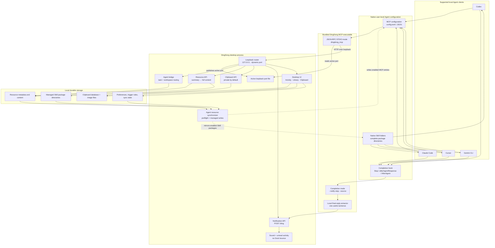

<p align="right">
  <strong>English</strong> · <a href="README.zh.md">简体中文</a>
</p>

<p align="center">
  
</p>

<h1 align="center">DingDong</h1>

<p align="center">
  <strong>Clipboard history and Agent tools in one place. A DingDong when the work is ready.</strong>
</p>

DingDong keeps the things you reuse—clipboard history, prompts, Skills, and MCP
servers—close to your local coding Agents. When an Agent finishes, gets stuck,
or needs a decision, DingDong calls you back with a short outcome instead of
making you watch the chat.

## What it does

- Finds text, links, images, files, and commands you copied earlier
- Organizes clipboard history with groups and user-defined matching rules
- Keeps prompts, complete Skill packages, and MCP configurations in one library
- Installs a complete online Skill directory, including `scripts/`,
  `references/`, and `assets/`, and updates it only when you ask
- Syncs enabled Skills and MCP servers into Codex, Claude Code, Cursor, and
  Gemini CLI while preserving unrelated configuration
- Applies resource groups only to matching workspace paths or repository URLs
- Lets Agents discover a small summary first and load full content only when it
  is useful
- Rings on the Agent's native completion event and shows the first useful
  sentence from the final reply when the client provides it
- Keeps clipboard and resource data on your computer by default

## Download

- [macOS · Apple Silicon](https://github.com/JevonsCode/DingDongBuddy/releases/latest)
- [macOS · Intel (beta)](https://github.com/JevonsCode/DingDongBuddy/releases/latest)
- [Windows x64 (beta)](https://github.com/JevonsCode/DingDongBuddy/releases/latest)

On macOS, open the `.dmg` and drag **DingDong** onto **Applications**. Quick
Paste needs Accessibility permission; ordinary clipboard history does not need
Full Disk Access or Screen Recording.

## How the Agent connection works

DingDong uses two native connections instead of asking the model to remember a
sentence at the end of every task:

1. **MCP bridge** — gives the Agent `dingdong_bridge`, resource lookup, and
   `dingdong_notify` tools.
2. **Completion hook** — runs deterministically after the client's final
   response and sends one local notification. The bundled executable extracts a
   short outcome from the hook payload or transcript; no second model call is
   made.

These are separate from the resources a user enables inside DingDong. Enabled
Skills are copied as complete native Skill directories. Enabled MCP resources
are written as real client MCP entries. Project rules currently narrow the
resources returned by `dingdong_bridge`; native Skill and MCP synchronization
follows the resource's enabled state.

### Architecture



The three main runtime paths are:

- **Task start:** Agent → `dingdong_bridge` → bounded names and descriptions →
  full resource only when needed.
- **Resource enable:** library enabled state → preflight → native Skill folder
  or MCP configuration, with DingDong-managed ownership markers. Project rules
  are applied separately when `dingdong_bridge` routes a task.
- **Task finish:** native completion hook → `--notify-stop` → local summary →
  `/ding` → sound and activity item.

## Connect an Agent

Keep DingDong running while using the bridge. This integration is local: a
cloud Agent cannot execute a path from your computer or reach its loopback API.

Open **DingDong → Agent API → MCP access** and copy the displayed executable
path. The usual macOS path is:

```text
/Applications/DingDong.app/Contents/MCP/bundle/bin/dingdong_mcp
```

On Windows, the bridge is inside the installed application at
`mcp\bundle\bin\dingdong_mcp.exe`. Copy the exact path shown in DingDong rather
than guessing the install directory.

### Automatic setup (recommended)

In **MCP access**, click **Copy**, paste the generated prompt into the local
Agent you want to connect, and let that Agent edit its own user configuration.
The prompt performs and reports two separate tests: one direct completion-hook
test and one `dingdong_notify` MCP test.

The generated prompt is platform-specific and is the canonical version. This
template shows the same flow; replace `<DINGDONG_MCP_PATH>` with the path copied
from the app:

```text
Connect DingDong on this computer to the current agent or IDE.
1. Verify that <DINGDONG_MCP_PATH> exists and is executable. Stop if this is a remote or cloud session.
2. Preserve all unrelated user settings and add a global STDIO MCP server named dingdong. Its command must be the complete <DINGDONG_MCP_PATH>; do not add MCP args, env, or a wrapper shell.
3. Add one durable native completion hook, without duplicates, that runs:
   "<DINGDONG_MCP_PATH>" --notify-stop --source "Current client name"
   Use Codex Stop in ~/.codex/config.toml, Claude Code Stop in ~/.claude/settings.json, Cursor afterAgentResponse in ~/.cursor/hooks.json, or Gemini CLI AfterAgent in ~/.gemini/settings.json.
4. Reload the client. For Codex, restart the MCP server and review and trust the hook in /hooks.
5. Pipe {"summary":"DingDong task-completion hook is connected"} to the hook command and confirm the notification arrives.
6. Confirm dingdong_notify exists, then call it once with message "DingDong MCP is connected" and the current client name as source.
7. Report only the changed user configuration files and whether both tests succeeded. Preserve existing configuration and return the original error on failure.
```

### Manual setup

The snippets below are fragments. Merge them into existing files; never replace
the entire file. In JSON, escape Windows backslashes as `\\`.

#### 1. Add the DingDong MCP server

**Codex — `~/.codex/config.toml`**

```toml
[mcp_servers.dingdong]
command = "/absolute/path/to/dingdong_mcp"
```

**Claude Code — user scope**

```bash
claude mcp add --transport stdio --scope user dingdong -- "/absolute/path/to/dingdong_mcp"
claude mcp list
```

Claude Code stores the user-scoped server in `~/.claude.json`.

**Cursor — `~/.cursor/mcp.json`**

```json
{
  "mcpServers": {
    "dingdong": {
      "command": "/absolute/path/to/dingdong_mcp"
    }
  }
}
```

**Gemini CLI — `~/.gemini/settings.json`**

```json
{
  "mcpServers": {
    "dingdong": {
      "command": "/absolute/path/to/dingdong_mcp"
    }
  }
}
```

#### 2. Add the native completion hook

Use the same executable with `--notify-stop`; unlike the MCP server, the hook
does have arguments.

**Codex — merge into `~/.codex/config.toml`**

```toml
[features]
hooks = true

[[hooks.Stop]]

[[hooks.Stop.hooks]]
type = "command"
command = '"/absolute/path/to/dingdong_mcp" --notify-stop --source "Codex"'
timeout = 10
```

After reloading Codex, open `/hooks` and trust the new definition. A later path
or command change creates a new hash and must be trusted again.

**Claude Code — append to `hooks.Stop` in `~/.claude/settings.json`**

```json
{
  "hooks": {
    "Stop": [
      {
        "hooks": [
          {
            "type": "command",
            "command": "\"/absolute/path/to/dingdong_mcp\" --notify-stop --source \"Claude Code\"",
            "timeout": 10
          }
        ]
      }
    ]
  }
}
```

Use `/hooks` to inspect the loaded definition.

**Cursor — append to `~/.cursor/hooks.json`**

```json
{
  "version": 1,
  "hooks": {
    "afterAgentResponse": [
      {
        "command": "\"/absolute/path/to/dingdong_mcp\" --notify-stop --source \"Cursor\""
      }
    ]
  }
}
```

Reload the Cursor window after changing the file. Use a local Agent session;
the hook still needs access to the locally running DingDong application.

**Gemini CLI — append to `hooks.AfterAgent` in `~/.gemini/settings.json`**

```json
{
  "hooks": {
    "AfterAgent": [
      {
        "hooks": [
          {
            "name": "dingdong-completion",
            "type": "command",
            "command": "\"/absolute/path/to/dingdong_mcp\" --notify-stop --source \"Gemini CLI\"",
            "timeout": 10000
          }
        ]
      }
    ]
  }
}
```

Use `/hooks panel` to inspect the hook.

#### 3. Verify both paths

First test the hook directly on macOS or Linux:

```bash
printf '%s' '{"summary":"DingDong completion hook is connected"}' \
  | "/absolute/path/to/dingdong_mcp" --notify-stop --source "Codex"
```

PowerShell:

```powershell
'{"summary":"DingDong completion hook is connected"}' |
  & "C:\absolute\path\to\dingdong_mcp.exe" --notify-stop --source "Codex"
```

The command returns `{}` and DingDong should ring. Then reload the MCP server,
confirm `dingdong_notify` appears, and call it once. A visible MCP tool does not
prove that the completion hook is installed, so both tests matter.

### Client mapping

| Client | MCP location | Completion hook | Summary source |
| --- | --- | --- | --- |
| Codex | `~/.codex/config.toml` | `Stop` | final answer in the local transcript |
| Claude Code | `~/.claude.json` | `Stop` in `~/.claude/settings.json` | `last_assistant_message` |
| Cursor | `~/.cursor/mcp.json` | `afterAgentResponse` in `~/.cursor/hooks.json` | response `text` |
| Gemini CLI | `~/.gemini/settings.json` | `AfterAgent` in the same file | `prompt_response` |

Upstream references: [Codex MCP](https://learn.chatgpt.com/docs/extend/mcp?surface=cli),
[Codex hooks](https://learn.chatgpt.com/docs/hooks),
[Claude Code MCP](https://code.claude.com/docs/en/mcp),
[Claude Code hooks](https://code.claude.com/docs/en/hooks),
[Cursor MCP](https://cursor.com/docs/context/model-context-protocol),
[Cursor hooks](https://cursor.com/docs/hooks),
[Gemini CLI MCP](https://geminicli.com/docs/tools/mcp-server/), and
[Gemini CLI hooks](https://geminicli.com/docs/hooks/reference/).

## Privacy and local data

- macOS: `~/Library/Application Support/DingDong`
- Windows: `%APPDATA%\DingDong`

The HTTP server binds only to `127.0.0.1`. Port `2333` is preferred; if it is
occupied, DingDong stores the actual bound port in its application data so the
bundled bridge can reconnect. Clipboard endpoints omit full and sensitive
content unless a caller explicitly requests a supported content mode.

DingDong does not include analytics or usage-event reporting. Before sharing a
bug report, remove clipboard contents, secrets, personal or company data,
usernames, and local paths.

## Development

### Desktop support

- macOS 13 or newer, Apple Silicon and Intel
- Windows 10 or newer
- Project toolchain: Flutter 3.44.6 / Dart 3.12

### Build and test

```bash
flutter pub get
flutter analyze
flutter test
flutter run -d macos
```

On Windows, use `flutter run -d windows`. Release builds compile the complete
MCP bridge bundle into the application distribution:

```bash
flutter build macos --release
flutter build windows --release
```

For repeatable local macOS upgrades, create the stable development signing
identity once, then seal each release bundle before installing it:

```bash
scripts/setup_macos_codesigning.sh
scripts/sign_macos_bundle.sh build/macos/Build/Products/Release/DingDong.app
```

### Project structure

```text
lib/
  app/                 composition, data paths, localization, theme
  core/                shared models and platform contracts
  features/
    agent_api/         loopback API, MCP bridge, hooks, Agent routing
    clipboard/         capture, classification, history, quick paste
    library/           resources, Skill packages, sync, import/export
    settings/          preferences, release and desktop settings
    shell/             navigation, tray and global desktop commands
    activity/          Agent activity and completion outcomes
  platform/            macOS and Windows adapters
bin/dingdong_mcp.dart  bundled STDIO and completion-hook entry point
macos/                 macOS application host
windows/               Windows application host
test/                  unit, contract, widget, performance and golden tests
```

### Main loopback routes

- `GET /health`
- `POST /ding`
- `GET|POST /library`
- `GET /library/export`
- `POST /library/import`
- `GET /clipboard/history`
- `POST /clipboard/capture`
- `POST /clipboard/restore/{id}`
- `GET|POST /agent/bridge`
- `GET /agent/manifest`

## Release

Pushing a `v*.*.*` tag runs `.github/workflows/release.yml`. It tests and builds
macOS Apple Silicon, macOS Intel, and Windows x64 packages, then publishes a
GitHub release. Apple distribution secrets enable Developer ID signing,
notarization, and stapling; otherwise CI produces an ad-hoc signed community
build.

## License

MIT. See [LICENSE](LICENSE).
