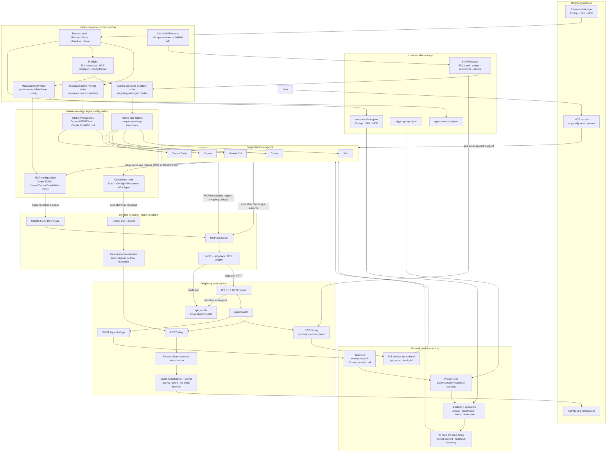

<p align="right">
  <strong>English</strong> · <a href="README.zh.md">简体中文</a>
</p>

<p align="center">
  
</p>

<h1 align="center">DingDong</h1>

<p align="center">
  <strong>Clipboard history and Agent tools in one place. A DingDong when the work is ready.</strong>
</p>

DingDong is a system-wide content hub for your local coding Agents. Collect
reusable clipboard content in one place, manage prompts, Skills, and MCP servers
centrally, and distribute them to Codex, Claude Code, and other Agents. DingDong
also gathers their completion, blocker, and decision alerts and turns them into
the familiar DingDong chime, so you can step away and return only when you are
needed.

## Install with an Agent

If you are using a local Codex, Claude Code, Cursor, Gemini CLI, or Kiro session, paste
the request below. The Agent will install the correct official release, start
DingDong, connect its MCP bridge and native completion Hook, and test both paths.

```text
Install DingDong on this computer from https://github.com/JevonsCode/DingDongBuddy. First read and execute https://raw.githubusercontent.com/JevonsCode/DingDongBuddy/main/INSTALL_WITH_AGENT.md. Complete the app installation, MCP setup, completion Hook setup, and both connection tests; preserve all existing user data and unrelated Agent settings. Do not merely summarize the guide.
```

The repository keeps the full, version-independent procedure in
[INSTALL_WITH_AGENT.md](INSTALL_WITH_AGENT.md). A local Agent that receives only
this repository URL should use that guide when the user has explicitly asked it
to install DingDong. The guide never asks the Agent to clone or build the source.

## What it does

- Finds text, links, images, files, and commands you copied earlier
- Organizes clipboard history with groups and user-defined matching rules
- Keeps prompts, complete Skill packages, and MCP configurations in one library
- Installs a complete GitHub or local Skill directory, including `scripts/`,
  `references/`, and `assets/`, and updates it only when you ask
- Syncs enabled global always-on Prompts into managed blocks in Codex
  `~/.codex/AGENTS.md` and Claude Code `~/.claude/CLAUDE.md` while preserving existing user instructions
- Syncs enabled unscoped Skills globally, strict project Skills only inside the
  selected project, and MCP servers into Codex, Claude Code, Cursor, Gemini
  CLI, and Kiro while preserving unrelated configuration
- Uses workspace paths and repository URLs to narrow each task's bridge suggestions
- Returns full Prompts by default while keeping Skills and MCP servers
  summary-first until they are needed
- Rings on the Agent's native completion event and shows the first useful
  sentence from the final reply when the client provides it
- Persists the tray unread count so unseen completion alerts survive app restarts
- Keeps a configurable, local, read-only history of Agent completion details
- Keeps clipboard and resource data on your computer by default

### Agent compatibility and verification

“Implemented” means DingDong has a client adapter and configuration path in the
repository. “Verified” means a real installed client has completed the MCP,
completion-hook, and applicable resource-sync paths end to end. These are kept
separate so source support is not presented as a guarantee for every client
release or operating system.

| Agent | MCP configuration | Completion notification | Managed native resources | Current verification |
| --- | --- | --- | --- | --- |
| Codex | `~/.codex/config.toml` | `Stop` | Prompt and Skill | **Verified end to end on macOS** |
| Claude Code | `~/.claude.json` | `Stop` | Prompt and Skill | **Verified end to end on macOS** |
| Cursor | `~/.cursor/mcp.json` | `afterAgentResponse` | Skill | Implemented; real-client end-to-end verification wanted |
| Gemini CLI | `~/.gemini/settings.json` | `AfterAgent` | Skill | Implemented; real-client end-to-end verification wanted |
| Kiro | `~/.kiro/settings/mcp.json` | CLI `stop` / IDE Agent Stop | Skill | Implemented; real-client end-to-end verification wanted |

Project- and task-matched Prompts are delivered through `dingdong_bridge` for
every connected client; the “Managed native resources” column lists files that
DingDong deploys directly into the client's native resource directories. To
move a row to **Verified**, include the operating system and client version and
confirm the MCP bridge, completion Hook, and applicable resource sync in the PR.

## Current interface behavior

- The header shows the current app version beside **DingDong**, for example
  `v0.7.25`, using the same version constant as the release UI. A small
  orange-red dot appears beside it when a newer version is available. Clicking
  the version opens Settings directly at the version and update section.
- Clicking the **DingDong** wordmark previews the currently configured sound;
  muted stays silent. Neither the wordmark nor version shows a hover tooltip or
  hover surface.
- The Clipboard metric on Today is the most recently loaded set of all clipboard
  records. Search, kind, category, and group filters do not change it, and the
  view loads at most the latest 5,000 records.
- With monitoring enabled, the native clipboard sequence is checked about every
  250ms and changes are written to local SQLite. The metric is not yet a strict
  real-time subscription; it reloads at UI startup, manual refresh, Clipboard
  workspace entry, or explicit capture.
- Entering Clipboard now reloads local history without recapturing the current
  system clipboard, so deleting the final item stays deleted after navigation.
  New copies still arrive through monitoring or the explicit capture action.
- Dragged clipboard group order is saved separately from record membership and
  restored when the clipboard or resource-manager window is reopened.
- **Recent agents** shows a compact rolling count beside its heading. The
  default window is 24 hours. Completion details default to the latest 200
  items, survive restart by default, and are available as a read-only list in
  Resource Manager. Remembering, detail capacity, and count-window hours are
  configurable in Settings.
- Tray unread state is acknowledged only after the tray is clicked and the panel
  stays visible for about 0.5 seconds. New alerts arriving during acknowledgement
  remain unread, and unread state is restored after an app restart.
- Confirmation, input, and management dialogs share a compact desktop treatment:
  14px corners, a hairline border, low elevation, restrained title hierarchy,
  non-pill buttons, and a consistent danger color for destructive actions.
- When Settings finds a newer release, **Update to …** performs the complete
  update in one action: download, signature verification, transactional
  replacement, obsolete-file cleanup, and relaunch. macOS uses Sparkle 2;
  Windows uses a per-user Velopack installation and does not need elevation.

## Download

- [macOS · Apple Silicon](https://github.com/JevonsCode/DingDongBuddy/releases/latest)
- [macOS · Intel (beta)](https://github.com/JevonsCode/DingDongBuddy/releases/latest)
- [Windows x64 (beta)](https://github.com/JevonsCode/DingDongBuddy/releases/latest)

On macOS, open the `.dmg` and drag **DingDong** onto **Applications**. Quick
Paste needs Accessibility permission; ordinary clipboard history does not need
Full Disk Access or Screen Recording.

The first release with built-in updates is a one-time migration boundary.
Existing macOS/ZIP installations must install that release manually once.
Windows users should run the Velopack `Setup.exe` once; subsequent releases can
be installed from Settings with one click. Portable Windows builds do not offer
self-update.

## How the Agent connection works

DingDong uses two native connections instead of asking the model to remember a
sentence at the end of every task:

1. **MCP bridge** — gives the Agent `dingdong_bridge`, resource lookup,
   configuration tools such as `dingdong_install_skill`, and `dingdong_notify`.
2. **Completion hook** — runs deterministically after the client's final
   response and sends one local notification. The bundled executable extracts a
   short outcome from the hook payload or transcript; no second model call is
   made.

These are separate from the resources a user enables inside DingDong. A global,
always-on Prompt is written into DingDong-managed blocks in Codex
`~/.codex/AGENTS.md` and Claude Code `~/.claude/CLAUDE.md`. Project-scoped and task-matched Prompts are routed by
`dingdong_bridge`, while Manual Prompts never activate automatically. Enabled
Unscoped Skills are copied to global native Skill directories; strict
project-scoped Skills are copied only below their selected projects. Enabled MCP
resources become real client MCP entries. The bridge includes full Prompt
content by default while keeping Skills and MCP servers summary-first.

### Prompt, Skill, and MCP invocation semantics

| Type | How it reaches the Agent | Required Agent behavior |
|---|---|---|
| Prompt | A global always-on Prompt is written directly into DingDong-managed Codex `AGENTS.md` and Claude Code `CLAUDE.md` blocks; project or task Prompts arrive in full from the bridge | Every active Prompt is a required instruction and is applied automatically; it is not an optional tool call |
| Skill | Unscoped Skills are synchronized globally; strict project Skills are synchronized only inside the selected project; the bridge returns candidate summaries only | Match the description first and load or use the complete Skill only when the task fits; a summary is not an instruction |
| MCP | Enabled MCP servers are written into native client configuration; the bridge returns candidate summaries only | Configuration means tools are available; call the relevant tool only when the task needs it, never automatically on every turn |

Activation and trigger groups filter bridge candidates. MCP servers remain
client-global. Strict project Skills also enforce the native filesystem boundary,
so they do not appear in the client's global Skill directory.

### Configure a Skill for one project

After the user explicitly asks for the change, an Agent can perform the whole
operation without asking the user to open Resource Manager:

1. `dingdong_install_skill` installs or updates a complete package from GitHub
   or an absolute local Skill path.
2. `dingdong_upsert_trigger_group` creates or reuses a group with an exact,
   existing absolute project path.
3. `dingdong_bind_resource_scope` binds the returned IDs with
   `strictProjectSkill: true`.
4. `dingdong_bridge` verifies one matching and one unrelated workspace.

The three writes are idempotent. Strict binding accepts only exact project-path
rules and rejects `contains`, repository, relative, root, missing, and unknown scopes. DingDong mirrors
the package into `.agents/skills`, `.claude/skills`, `.cursor/skills`,
`.gemini/skills`, or `.kiro/skills` below the configured project when the corresponding client is
installed. These locations follow the clients' native project Skill discovery
rules: [Codex](https://learn.chatgpt.com/docs/build-skills),
[Claude Code](https://code.claude.com/docs/en/skills),
[Cursor](https://cursor.com/docs/skills),
[Gemini CLI](https://geminicli.com/docs/cli/using-agent-skills/), and
[Kiro](https://kiro.dev/docs/skills/).

A new MCP-installed Skill remains disabled until binding succeeds, so it is not
briefly exposed through DingDong's global sync. Strict scope can remove only
DingDong-managed global copies; if the original local source is itself a
user-owned global Skill, move/remove that original explicitly or install from a
neutral directory/GitHub source before treating the isolation as complete.

The DingDong library and internal Package Store are the logical single source
for each Skill. Native Agent Skill directories contain atomic deployment mirrors,
not independently maintained copies. DingDong does not use symlinks because
discovery and link-following behavior varies across clients, packaging, and
permission environments. It updates or removes only mirrors carrying the
`.dingdong-managed` marker. Saving an edited or renamed Skill refreshes every
active Agent mirror and removes the previous managed directory name.

Every write is preflighted. If a user-owned Skill already occupies the same name,
or two enabled DingDong Skills resolve to one destination, the save is rolled
back and existing files remain untouched. A red issue icon replaces the former
refresh control and opens the persistent Issues workspace in Resource Manager.
That first-level destination is always available for reviewing the client,
resource, and target path, opening the affected resource, or running a manual
check. Enabled Claude Code plugins are also inspected: an exact Skill-name match
is shown as a non-blocking warning because the plugin namespace can coexist with
the native Skill. The old simulated refresh behavior has been removed. Client
paths and capabilities live in one Agent adapter registry, so a future client is
added through an adapter rather than scattered sync branches.

### Architecture



The four main paths are:

- **Setup:** copy the generated prompt → the Agent writes its native MCP and
  completion-hook configuration → reload and test both paths separately.
- **Task start:** Agent → `dingdong_bridge` → full Prompt content plus Skill/MCP
  summaries → full Skill loading or MCP calls only when needed.
- **Resource enable:** library enabled state → managed Codex or Claude Code global Prompt block,
  global or project-native Skill folder, or MCP configuration, with DingDong
  ownership markers preserving unrelated user files. Strict Skill scope affects
  both native placement and `dingdong_bridge` routing.
- **Task finish:** native completion hook → `--notify-stop` → local summary →
  `/ding` → sound and activity item.

## Connect an Agent

Keep DingDong running while using the bridge. This integration is local: a
cloud Agent cannot execute a path from your computer or reach its loopback API.

Open **DingDong → Agent API → MCP access** and copy the displayed executable
path. The usual macOS path is:

```text
/Applications/DingDong.app/Contents/MCP/bundle/bin/dingdong_mcp
```

On Windows, the bridge is inside the installed application at
`mcp\bundle\bin\dingdong_mcp.exe`. Copy the exact path shown in DingDong rather
than guessing the install directory.

### Automatic setup (recommended)

In **MCP access**, click **Copy**, paste the generated prompt into the local
Agent you want to connect, and let that Agent edit its own user configuration.
The prompt performs and reports two separate tests: one direct completion-hook
test and one `dingdong_notify` MCP test.

The generated prompt is platform-specific and is the canonical version. This
template shows the same flow; replace `<DINGDONG_MCP_PATH>` with the path copied
from the app:

```text
Connect DingDong on this computer to the current agent or IDE.
1. Verify that <DINGDONG_MCP_PATH> exists and is executable. Stop if this is a remote or cloud session.
2. Preserve all unrelated user settings and add a global STDIO MCP server named dingdong. Its command must be the complete <DINGDONG_MCP_PATH>; do not add MCP args, env, or a wrapper shell.
3. Add one durable native completion hook, without duplicates, that runs:
   "<DINGDONG_MCP_PATH>" --notify-stop --source "Current client name"
   Use Codex Stop in ~/.codex/config.toml, Claude Code Stop in ~/.claude/settings.json, Cursor afterAgentResponse in ~/.cursor/hooks.json, Gemini CLI AfterAgent in ~/.gemini/settings.json, or a Kiro Stop hook.
4. Reload the client. For Codex, restart the MCP server and review and trust the hook in /hooks.
5. Keep resource semantics distinct: apply every active Prompt automatically and in full; match a Skill description before loading it; call MCP tools only when the task needs them. Skill and MCP summaries are not Prompt instructions. For an explicit project Skill request, use dingdong_install_skill, dingdong_upsert_trigger_group, then dingdong_bind_resource_scope with strictProjectSkill.
6. Pipe {"summary":"DingDong task-completion hook is connected"} to the hook command and confirm the notification arrives.
7. Confirm dingdong_notify exists, then call it once with message "DingDong MCP is connected" and the current client name as source.
8. Report only the changed user configuration files and whether both tests succeeded. Preserve existing configuration and return the original error on failure.
```

### Manual setup

The snippets below are fragments. Merge them into existing files; never replace
the entire file. In JSON, escape Windows backslashes as `\\`.

#### 1. Add the DingDong MCP server

**Codex — `~/.codex/config.toml`**

```toml
[mcp_servers.dingdong]
command = "/absolute/path/to/dingdong_mcp"
```

**Claude Code — user scope**

```bash
claude mcp add --transport stdio --scope user dingdong -- "/absolute/path/to/dingdong_mcp"
claude mcp list
```

Claude Code stores the user-scoped server in `~/.claude.json`.

**Cursor — `~/.cursor/mcp.json`**

```json
{
  "mcpServers": {
    "dingdong": {
      "command": "/absolute/path/to/dingdong_mcp"
    }
  }
}
```

**Gemini CLI — `~/.gemini/settings.json`**

```json
{
  "mcpServers": {
    "dingdong": {
      "command": "/absolute/path/to/dingdong_mcp"
    }
  }
}
```

**Kiro — `~/.kiro/settings/mcp.json`**

```json
{
  "mcpServers": {
    "dingdong": {
      "command": "/absolute/path/to/dingdong_mcp"
    }
  }
}
```

#### 2. Add the native completion hook

Use the same executable with `--notify-stop`; unlike the MCP server, the hook
does have arguments.

**Codex — merge into `~/.codex/config.toml`**

```toml
[features]
hooks = true

[[hooks.Stop]]

[[hooks.Stop.hooks]]
type = "command"
command = '"/absolute/path/to/dingdong_mcp" --notify-stop --source "Codex"'
timeout = 10
```

After reloading Codex, open `/hooks` and trust the new definition. A later path
or command change creates a new hash and must be trusted again.

**Claude Code — append to `hooks.Stop` in `~/.claude/settings.json`**

```json
{
  "hooks": {
    "Stop": [
      {
        "hooks": [
          {
            "type": "command",
            "command": "\"/absolute/path/to/dingdong_mcp\" --notify-stop --source \"Claude Code\"",
            "timeout": 10
          }
        ]
      }
    ]
  }
}
```

Use `/hooks` to inspect the loaded definition.

**Cursor — append to `~/.cursor/hooks.json`**

```json
{
  "version": 1,
  "hooks": {
    "afterAgentResponse": [
      {
        "command": "\"/absolute/path/to/dingdong_mcp\" --notify-stop --source \"Cursor\""
      }
    ]
  }
}
```

Reload the Cursor window after changing the file. Use a local Agent session;
the hook still needs access to the locally running DingDong application.

**Gemini CLI — append to `hooks.AfterAgent` in `~/.gemini/settings.json`**

```json
{
  "hooks": {
    "AfterAgent": [
      {
        "hooks": [
          {
            "name": "dingdong-completion",
            "type": "command",
            "command": "\"/absolute/path/to/dingdong_mcp\" --notify-stop --source \"Gemini CLI\"",
            "timeout": 10000
          }
        ]
      }
    ]
  }
}
```

Use `/hooks panel` to inspect the hook.

**Kiro CLI — `hooks.stop` in the active editable Agent**

```json
{
  "hooks": {
    "stop": [
      {
        "command": "\"/absolute/path/to/dingdong_mcp\" --notify-stop --source \"Kiro\""
      }
    ]
  }
}
```

Kiro CLI v3 can instead use a global hook under `~/.kiro/hooks/`. Built-in
Agents cannot be edited, so use Kiro's hook manager for a global hook or an
editable custom Agent and confirm it with `/hooks`. In Kiro IDE, create an
Agent Stop shell-command hook from the Agent Hooks panel; do not add a
workspace hook without the user's permission.

#### 3. Verify both paths

First test the hook directly on macOS or Linux:

```bash
printf '%s' '{"summary":"DingDong completion hook is connected"}' \
  | "/absolute/path/to/dingdong_mcp" --notify-stop --source "Codex"
```

PowerShell:

```powershell
'{"summary":"DingDong completion hook is connected"}' |
  & "C:\absolute\path\to\dingdong_mcp.exe" --notify-stop --source "Codex"
```

The command returns `{}` and DingDong should ring. Then reload the MCP server,
confirm `dingdong_notify` appears, and call it once. A visible MCP tool does not
prove that the completion hook is installed, so both tests matter.

### Client mapping

| Client | MCP location | Completion hook | Summary source |
| --- | --- | --- | --- |
| Codex | `~/.codex/config.toml` | `Stop` | final answer in the local transcript |
| Claude Code | `~/.claude.json` | `Stop` in `~/.claude/settings.json` | `last_assistant_message` |
| Cursor | `~/.cursor/mcp.json` | `afterAgentResponse` in `~/.cursor/hooks.json` | response `text` |
| Gemini CLI | `~/.gemini/settings.json` | `AfterAgent` in the same file | `prompt_response` |
| Kiro | `~/.kiro/settings/mcp.json` | CLI `stop` / IDE Agent Stop | `assistant_response` |

Upstream references: [Codex MCP](https://learn.chatgpt.com/docs/extend/mcp?surface=cli),
[Codex hooks](https://learn.chatgpt.com/docs/hooks),
[Claude Code MCP](https://code.claude.com/docs/en/mcp),
[Claude Code hooks](https://code.claude.com/docs/en/hooks),
[Cursor MCP](https://cursor.com/docs/context/model-context-protocol),
[Cursor hooks](https://cursor.com/docs/hooks),
[Gemini CLI MCP](https://geminicli.com/docs/tools/mcp-server/),
[Gemini CLI hooks](https://geminicli.com/docs/hooks/reference/),
[Kiro MCP](https://kiro.dev/docs/mcp/configuration/), and
[Kiro CLI hooks](https://kiro.dev/docs/cli/hooks/).

## Privacy and local data

- macOS: `~/Library/Application Support/DingDong`
- Windows: `%APPDATA%\DingDong`

The HTTP server binds only to `127.0.0.1`. Port `2333` is preferred; if it is
occupied, DingDong stores the actual bound port in its application data so the
bundled bridge can reconnect. Clipboard endpoints omit full and sensitive
content unless a caller explicitly requests a supported content mode.

Agent completion details are stored in `agent-activity.json` in the same local
application-data directory. The rolling-count metadata stores completion times
only; it does not duplicate response text.

DingDong does not include analytics or usage-event reporting. Before sharing a
bug report, remove clipboard contents, secrets, personal or company data,
usernames, and local paths.

## Development

### Desktop support

- macOS 13 or newer, Apple Silicon and Intel
- Windows 10 or newer
- Project toolchain: Flutter 3.44.6 / Dart 3.12

### Build and test

```bash
flutter pub get
flutter analyze
flutter test
flutter run -d macos
```

On Windows, use `flutter run -d windows`. Release builds compile the complete
MCP bridge bundle into the application distribution:

```bash
flutter build macos --release
flutter build windows --release
```

For repeatable local macOS upgrades, create the stable development signing
identity once, then seal each release bundle before installing it:

```bash
scripts/setup_macos_codesigning.sh
scripts/sign_macos_bundle.sh build/macos/Build/Products/Release/DingDong.app
```

### Project structure

```text
lib/
  app/                 composition, data paths, localization, theme
  core/                shared models and platform contracts
  features/
    agent_api/         loopback API, MCP bridge, hooks, Agent routing
    clipboard/         capture, classification, history, quick paste
    library/           resources, Skill packages, sync, import/export
    settings/          preferences, release and desktop settings
    shell/             navigation, tray and global desktop commands
    activity/          Agent activity and completion outcomes
  platform/            macOS and Windows adapters
bin/dingdong_mcp.dart  bundled STDIO and completion-hook entry point
macos/                 macOS application host
windows/               Windows application host
test/                  unit, contract, widget, performance and golden tests
```

### Main loopback routes

- `GET /health`
- `POST /ding`
- `GET|POST /library`
- `GET /library/export`
- `POST /library/import`
- `GET /clipboard/history`
- `POST /clipboard/capture`
- `POST /clipboard/restore/{id}`
- `GET|POST /agent/bridge`
- `GET /agent/manifest`

## Release

Pushing a `v*.*.*` tag runs `.github/workflows/release.yml`. It tests and builds
macOS Apple Silicon, macOS Intel, and Windows x64 packages, then publishes a
GitHub release. The workflow also publishes architecture-specific Sparkle
appcasts and Velopack's `releases.win.json`, full package, and per-user Setup.

Sparkle update signing is free and independent of an Apple Developer account.
Generate its Ed25519 keypair once, keeping the export outside the repository:

```bash
scripts/setup_sparkle_keys.sh /secure/private/dingdong-sparkle-key
```

Store the printed public key as the `SPARKLE_PUBLIC_ED_KEY` GitHub Actions secret
and the exported file contents as `SPARKLE_PRIVATE_ED_KEY`. Release CI refuses
to publish a macOS build without both, so an unsigned update cannot silently
enter the feed. Apple distribution secrets remain optional: they enable
Developer ID signing, notarization, and stapling; without them CI produces an
ad-hoc signed community build. In that community build, Sparkle's EdDSA
signature still authenticates the update archive, but macOS Gatekeeper behavior
and permission inheritance cannot be guaranteed like they can with a stable
Developer ID identity.

## License

MIT. See [LICENSE](LICENSE).
