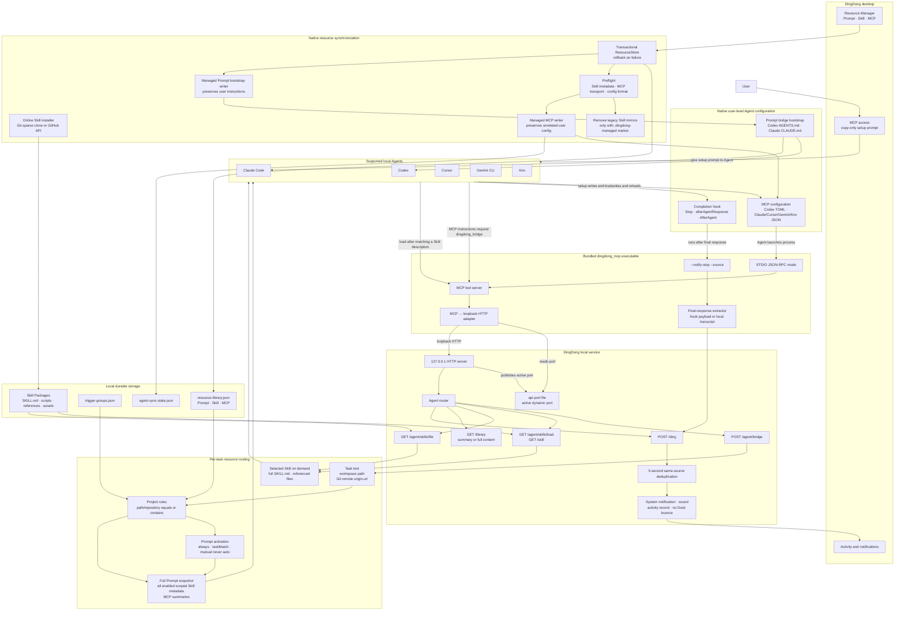

<p align="right">
  <strong>English</strong> · <a href="README.zh.md">简体中文</a>
</p>

<p align="center">
  
</p>

<h1 align="center">DingDong</h1>

<p align="center">
  <strong>Clipboard history and Agent tools in one place. A DingDong when the work is ready.</strong>
</p>

DingDong is a system-wide content hub for your local coding Agents. Collect
reusable clipboard content in one place, manage prompts, Skills, and MCP servers
centrally, and distribute them to Codex, Claude Code, and other Agents. DingDong
also gathers their completion, blocker, and decision alerts and turns them into
the familiar DingDong chime, so you can step away and return only when you are
needed.

## Install with an Agent

If you are using a local Codex, Claude Code, Cursor, Gemini CLI, or Kiro session, paste
the request below. The Agent will install the correct official release, start
DingDong, connect its MCP bridge and native completion Hook, and test both paths.

```text
Install DingDong on this computer from https://github.com/JevonsCode/DingDongBuddy. First read and execute https://raw.githubusercontent.com/JevonsCode/DingDongBuddy/main/INSTALL_WITH_AGENT.md. Complete the app installation, MCP setup, completion Hook setup, and both connection tests; preserve all existing user data and unrelated Agent settings. Do not merely summarize the guide.
```

The repository keeps the full, version-independent procedure in
[INSTALL_WITH_AGENT.md](INSTALL_WITH_AGENT.md). A local Agent that receives only
this repository URL should use that guide when the user has explicitly asked it
to install DingDong. The guide never asks the Agent to clone or build the source.

## What it does

- Finds text, links, images, files, and commands you copied earlier
- Organizes clipboard history with groups and user-defined matching rules
- Keeps prompts, complete Skill packages, and MCP configurations in one library
- Installs a complete GitHub or local Skill directory, including `scripts/`,
  `references/`, and `assets/`, and updates it only when you ask
- Keeps a small Prompt-bridge bootstrap in Codex `~/.codex/AGENTS.md` and
  Claude Code `~/.claude/CLAUDE.md` while preserving existing user instructions
- Publishes enabled, scope-matched Skills as a dynamic name/description catalog;
  loads complete `SKILL.md` documents and referenced package files only when an
  Agent chooses a matching Skill
- Syncs enabled MCP servers into Codex, Claude Code, Cursor, Gemini CLI, and
  Kiro while preserving unrelated configuration
- Uses workspace paths and repository URLs to narrow each task's bridge suggestions
- Returns full Prompts by default while keeping Skills and MCP servers
  summary-first until they are needed
- Rings on the Agent's native completion event and shows the first useful
  sentence from the final reply when the client provides it
- Persists the tray unread count so unseen completion alerts survive app restarts
- Keeps a configurable, local, read-only history of Agent completion details
- Keeps clipboard and resource data on your computer by default

### Agent compatibility and verification

“Implemented” means DingDong has a client adapter and configuration path in the
repository. “Verified” means a real installed client has completed the MCP,
completion-hook, and applicable resource-sync paths end to end. These are kept
separate so source support is not presented as a guarantee for every client
release or operating system.

| Agent | MCP configuration | Completion notification | Managed native bootstrap | Current verification |
| --- | --- | --- | --- | --- |
| Codex | `~/.codex/config.toml` | `Stop` | Prompt Bridge | **Verified end to end on macOS** |
| Claude Code | `~/.claude.json` | `Stop` | Prompt Bridge | **Verified end to end on macOS** |
| Cursor | `~/.cursor/mcp.json` | `afterAgentResponse` | None | Implemented; real-client end-to-end verification wanted |
| Gemini CLI | `~/.gemini/settings.json` | `AfterAgent` | None | Implemented; real-client end-to-end verification wanted |
| Kiro | `~/.kiro/settings/mcp.json` | CLI `stop` / IDE Agent Stop | None | Implemented; real-client end-to-end verification wanted |

All enabled automatic Prompts and the authoritative Skill catalog are delivered
through `dingdong_bridge` for every connected client. The “Managed native
bootstrap” column lists only the fixed Bridge instructions DingDong writes into
the client's native instruction file; managed Skills remain in DingDong and load
on demand. To move a row to **Verified**, include the operating system and client
version and confirm the MCP bridge, completion Hook, and applicable bootstrap
sync in the PR.

## Current interface behavior

- The header shows the current app version beside **DingDong**, for example
  `v0.9.7`, using the same version constant as the release UI. A small
  orange-red dot appears beside it when a newer version is available. Clicking
  the version opens Settings directly at the version and update section.
- Clicking the **DingDong** wordmark previews the currently configured sound;
  muted stays silent. Neither the wordmark nor version shows a hover tooltip or
  hover surface.
- The Clipboard metric on Today is the most recently loaded set of all clipboard
  records. Search, kind, category, and group filters do not change it, and the
  view loads at most the latest 5,000 records.
- With monitoring enabled, the native clipboard sequence is checked about every
  250ms and changes are written to local SQLite. The metric is not yet a strict
  real-time subscription; it reloads at UI startup, manual refresh, Clipboard
  workspace entry, or explicit capture.
- Entering Clipboard now reloads local history without recapturing the current
  system clipboard, so deleting the final item stays deleted after navigation.
  New copies still arrive through monitoring or the explicit capture action.
- Dragged clipboard group order is saved separately from record membership and
  restored when the clipboard or resource-manager window is reopened.
- Automatic clipboard retention defaults to 5,000 unarchived items and 120
  days; pinned and archived items are excluded from both limits.
- Copied image files keep only their source paths; DingDong does not duplicate
  those files, so moving or deleting a source makes that history item
  unavailable. Image data copied without a source file, such as a screenshot,
  is persisted under `Clipboard Images` and follows the same item and age
  limits. Its managed file is retained while the record is pinned or archived.
- **Recent agents** shows a compact rolling count beside its heading. The
  default window is 24 hours. Completion details default to the latest 500
  items, survive restart by default, and are available as a read-only list in
  Resource Manager. Remembering, detail capacity, and count-window hours are
  configurable in Settings.
- Tray unread state is acknowledged only after the tray is clicked and the panel
  stays visible for about 0.5 seconds. New alerts arriving during acknowledgement
  remain unread, and unread state is restored after an app restart.
- Confirmation, input, and management dialogs share a compact desktop treatment:
  14px corners, a hairline border, low elevation, restrained title hierarchy,
  non-pill buttons, and a consistent danger color for destructive actions.
- When Settings finds a newer release, **Update to …** performs the complete
  update in one action: download, signature verification, transactional
  replacement, obsolete-file cleanup, and relaunch. macOS uses Sparkle 2;
  Windows uses a per-user Velopack installation and does not need elevation.

## Default shortcuts and settings

The system-wide **Open or hide Clipboard** shortcut and all three in-panel
workspace shortcuts are configurable in **Settings → Keyboard shortcuts**.
Click the current shortcut, press a new combination, and it takes effect
immediately. A shortcut must contain at least one modifier and may use a letter,
number, F1–F12, arrow key, Space, or Return. DingDong keeps the previous
shortcut when a new combination conflicts with another workspace, an existing
DingDong action, a reserved system action, or an unavailable global shortcut.

| Action | macOS | Windows |
| --- | --- | --- |
| Open or hide Clipboard | `⌘⇧V` (configurable) | `Ctrl+Shift+V` (configurable) |
| Open Dynamic / Library / Clipboard | `⌃Q` / `⌃W` / `⌃E` (individually configurable) | `Alt+Q` / `Alt+W` / `Alt+E` (individually configurable) |
| Focus Clipboard search | `⌘F` | `Ctrl+F` |
| Open, reset, or hide Clipboard filters | `⌘R` | `Ctrl+R` |
| Use visible Clipboard item 1–9 | `⌘1`–`⌘9` | `Ctrl+1`–`Ctrl+9` |
| Paste visible item 1–9 as plain text | `⌥⌘1`–`⌥⌘9` | — |
| Move Clipboard selection | `↑` / `↓` | `↑` / `↓` |
| Preview selected item | `Space` | `Space` |
| Use selected item | `Return` | `Enter` |
| Close preview, then hide the panel | `Esc` | `Esc` |

Settings are stored locally and take effect immediately unless noted:

| Setting | Default | Available values or limits |
| --- | --- | --- |
| Open or hide Clipboard | `⌘⇧V` | Configurable shortcut; Windows default is `Ctrl+Shift+V` |
| Launch at startup | Off | On / off |
| Hide Dock icon (macOS) | Off | On / off |
| Language | System | System / English / 中文 |
| Theme | Light | System / Light / Dark |
| Window opacity | 90% | 82%–96% |
| List density | Comfortable | Comfortable / Compact |
| Default workspace | Dynamic | Dynamic / Library / Clipboard |
| Clipboard monitoring | Off | On / off |
| Clipboard retention | 5,000 items, 120 days | 20–5,000 items; 1–730 days |
| Allow Agents to read clipboard content | Off | On / off; metadata remains available |
| Remember Recent Agents | On | On / off |
| Recent Agent limits | 500 details, 24-hour count | 1–5,000 details; 1–8,760 hours |
| Completion sound | DingDong Classic | Classic, Soft, Bright, Crisp, Deep, custom file, system sound, or muted |
| Menu bar alert color (macOS) | Orange | Orange / Pink / Blue / Green / Purple |
| Local Agent API port | `2333` | `1024`–`65535`; changing it requires restart |

## Download

- [macOS · Apple Silicon](https://github.com/JevonsCode/DingDongBuddy/releases/latest)
- [macOS · Intel (beta)](https://github.com/JevonsCode/DingDongBuddy/releases/latest)
- [Windows x64 (beta)](https://github.com/JevonsCode/DingDongBuddy/releases/latest)

On macOS, open the `.dmg` and drag **DingDong** onto **Applications**. Quick
Paste needs Accessibility permission; ordinary clipboard history does not need
Full Disk Access or Screen Recording.

The first release with built-in updates is a one-time migration boundary.
Existing macOS/ZIP installations must install that release manually once.
Windows users should run the Velopack `Setup.exe` once; subsequent releases can
be installed from Settings with one click. Portable Windows builds do not offer
self-update.

## How the Agent connection works

DingDong uses two native connections instead of asking the model to remember a
sentence at the end of every task:

1. **MCP bridge** — gives the Agent `dingdong_bridge`, resource lookup,
   configuration tools such as `dingdong_install_skill`, and `dingdong_notify`.
2. **Completion hook** — runs deterministically after the client's final
   response and sends one local notification. The bundled executable extracts a
   short outcome from the hook payload or transcript; no second model call is
   made.

These are separate from the resources a user enables inside DingDong. Codex
`~/.codex/AGENTS.md` and Claude Code `~/.claude/CLAUDE.md` contain only a small,
persistent bootstrap that requests `dingdong_bridge` at the start of each user
task. The bridge dynamically returns enabled global, project-scoped, and
task-matched Prompts in full, so editing or disabling one takes effect on the
next bridge call without copying its body into native instruction files. Each
successful call is the authoritative Prompt snapshot for that task and replaces
the previous set. Manual Prompts never activate automatically. The same call
returns the authoritative complete catalog of every valid, enabled, scope-matched
Skill as `id`, `name`, and `description` only. The Agent loads a selected
Skill's complete `SKILL.md` by ID or name and reads referenced package files
through DingDong on demand. The same response includes every active,
scope-matched MCP and Knowledge candidate as summary metadata. DingDong does
not copy managed Skills into native Agent Skill directories. Enabled MCP
resources become real client MCP entries.

### Prompt, Skill, and MCP invocation semantics

| Type | How it reaches the Agent | Required Agent behavior |
|---|---|---|
| Prompt | Native instruction files contain only a persistent bridge bootstrap; enabled global, project, and task-matched Prompts arrive dynamically and in full from `dingdong_bridge` | Call the bridge at the start of every user task; treat the successful response as an authoritative replacement snapshot and apply every returned active Prompt automatically |
| Skill | Every successful bridge call returns the authoritative complete catalog of every valid, enabled, scope-matched Skill as `id`, `name`, and `description` only; the full package remains in DingDong | Match a returned description first, call `dingdong_load_skill` with its ID or name, apply the returned complete `SKILL.md`, and read only referenced files with `dingdong_read_skill_file`; a candidate is not an instruction, and an absent Skill is unavailable, disabled, invalid, or out of scope |
| MCP | Enabled MCP servers are written into native client configuration; the bridge returns candidate summaries only | Configuration means tools are available; call the relevant tool only when the task needs it, never automatically on every turn |

Prompt activation and trigger groups filter Prompt delivery. Skill candidates
are filtered by enabled state and trigger groups, and every full-content or file
load re-checks the same conditions. MCP servers remain client-global.

### Configure a Skill for one project

After the user explicitly asks for the change, an Agent can perform the whole
operation without asking the user to open Resource Manager:

1. `dingdong_install_skill` installs or updates a complete package from GitHub
   or an absolute local Skill path.
2. `dingdong_upsert_trigger_group` creates or reuses a group with an exact,
   existing absolute project path.
3. `dingdong_bind_resource_scope` binds the returned IDs with
   `strictProjectSkill: true`; this legacy parameter now means strict dynamic
   loading scope rather than native file placement.
4. `dingdong_bridge` and `dingdong_load_skill` each verify one matching and one
   unrelated workspace.

The three writes are idempotent. Strict binding accepts only exact project-path
rules and rejects `contains`, repository, relative, root, missing, and unknown
scopes. The package remains in DingDong's Package Store. A matching workspace
can discover and load it dynamically; another workspace cannot.

A new MCP-installed Skill remains disabled until binding succeeds, so it is not
briefly exposed through the dynamic catalog. A separate native Skill installed
outside DingDong is independent: DingDong's switch cannot hide or remove it.

The DingDong library and internal Package Store are the single source for each
managed Skill. On synchronization, DingDong removes only obsolete native copies
that carry its `.dingdong-managed` marker and never removes an independently
installed native Skill. A same-name native Skill or enabled Claude Code plugin
is reported as a non-blocking warning because it remains available outside
DingDong's switch. Duplicate enabled DingDong Skill names are also warned:
Agents must use the catalog `id` to disambiguate the load.

A red issue icon opens the persistent Issues workspace in Resource Manager for
reviewing client, resource, and path diagnostics. Client paths and capabilities
live in extensible Agent Adapters. Skill paths remain in Adapters for legacy
managed-copy cleanup and independent native-Skill collision checks; they are no
longer deployment destinations. **Resource Manager → Agent access** opens with
an evidence summary: valid YAML, detected directory, and declared MCP, Prompt,
and Skill paths. These signals never claim that MCP, Hook, or Bridge is
connected. YAML editing and comparison of the current and two prior Adapter
versions remain available under **Advanced config**; external Agent edits to
user YAML are observed automatically. See
[Agent Adapter configuration](docs/product/agent-adapter-configuration.md).

### Architecture


```mermaid
flowchart TB
  User["User"]

  subgraph UI["DingDong desktop"]
    SetupUI["MCP access<br/>copy-only setup prompt"]
    ResourceUI["Resource Manager<br/>Prompt · Skill · MCP"]
    ActivityUI["Activity and notifications"]
  end

  subgraph Clients["Supported local Agents"]
    Codex["Codex"]
    Claude["Claude Code"]
    Cursor["Cursor"]
    Gemini["Gemini CLI"]
    Kiro["Kiro"]
  end

  User --> SetupUI
  SetupUI -->|"give setup prompt to Agent"| Clients

  subgraph NativeConfig["Native user-level Agent configuration"]
    McpConfig["MCP configuration<br/>Codex TOML · Claude/Cursor/Gemini/Kiro JSON"]
    HookConfig["Completion hook<br/>Stop · afterAgentResponse · AfterAgent"]
    PromptFile["Prompt bridge bootstrap<br/>Codex AGENTS.md · Claude CLAUDE.md"]
  end

  Clients -->|"setup writes and reloads"| McpConfig
  Clients -->|"setup writes and trusts"| HookConfig
  PromptFile --> Codex
  PromptFile --> Claude

  subgraph Executable["Bundled dingdong_mcp executable"]
    Stdio["STDIO JSON-RPC mode"]
    ToolServer["MCP tool server"]
    ToolExecutor["MCP → loopback HTTP adapter"]
    StopMode["--notify-stop --source"]
    Summary["Final-response extractor<br/>hook payload or local transcript"]
  end

  McpConfig -->|"Agent launches process"| Stdio
  Stdio --> ToolServer --> ToolExecutor
  HookConfig -->|"runs after final response"| StopMode
  StopMode --> Summary

  subgraph Loopback["DingDong local service"]
    PortFile["api-port file<br/>active dynamic port"]
    HTTP["127.0.0.1 HTTP server"]
    Router["Agent router"]
    Bridge["POST /agent/bridge"]
    SkillLoad["GET /agent/skills/load<br/>GET /skill"]
    SkillFile["GET /agent/skills/file"]
    Library["GET /library<br/>summary or full content"]
    Ding["POST /ding"]
    Deduplicate["5-second same-source deduplication"]
    Notification["System notification · sound<br/>activity record · no Dock bounce"]
  end

  HTTP -->|"publishes active port"| PortFile
  ToolExecutor -->|"reads port"| PortFile
  ToolExecutor -->|"loopback HTTP"| HTTP
  HTTP --> Router
  Router --> Bridge
  Router --> SkillLoad
  Router --> SkillFile
  Router --> Library
  Router --> Ding
  Summary --> Ding
  Ding --> Deduplicate --> Notification --> ActivityUI

  subgraph Routing["Per-task resource routing"]
    Context["Task text<br/>workspace path<br/>Git remote.origin.url"]
    Scope["Project rules<br/>path/repository equals or contains"]
    PromptActivation["Prompt activation<br/>always · taskMatch · manual never auto"]
    Delivery["Full Prompt snapshot<br/>all enabled scoped Skill metadata<br/>MCP summaries"]
    FullLoad["Selected Skill on demand<br/>full SKILL.md · referenced files"]
  end

  Clients -->|"MCP instructions request dingdong_bridge"| ToolServer
  Bridge --> Context --> Scope
  Scope --> PromptActivation --> Delivery --> Clients
  Scope --> Delivery
  Clients -->|"load after matching a Skill description"| ToolServer
  SkillLoad --> FullLoad --> Clients
  SkillFile --> FullLoad

  subgraph Storage["Local durable storage"]
    ResourceStore["resource-library.json<br/>Prompt · Skill · MCP"]
    TriggerStore["trigger-groups.json"]
    PackageStore["Skill Packages<br/>SKILL.md · scripts · references · assets"]
    SyncState["agent-sync-state.json"]
  end

  ResourceStore --> Scope
  TriggerStore --> Scope
  PackageStore --> SkillLoad
  PackageStore --> SkillFile

  subgraph Sync["Native resource synchronization"]
    Transaction["Transactional ResourceStore<br/>rollback on failure"]
    Preflight["Preflight<br/>Skill metadata · MCP transport · config format"]
    SkillInstaller["Online Skill installer<br/>Git sparse clone or GitHub API"]
    LegacyCleanup["Remove legacy Skill mirrors<br/>only with .dingdong-managed marker"]
    PromptWriter["Managed Prompt bootstrap writer<br/>preserves user instructions"]
    MCPWriter["Managed MCP writer<br/>preserves unrelated user config"]
  end

  ResourceUI --> Transaction --> ResourceStore
  Transaction --> Preflight
  SkillInstaller --> PackageStore
  Transaction --> PromptWriter --> PromptFile
  Preflight --> LegacyCleanup
  Preflight --> MCPWriter
  MCPWriter --> McpConfig
  MCPWriter --> SyncState
```

The main paths are:

- **Setup:** copy the generated prompt → the Agent writes its native MCP and
  completion-hook configuration → reload and test both paths separately.
- **Task start:** Agent → `dingdong_bridge` → full Prompt snapshot, complete
  scope-matched Skill metadata catalog, and MCP summaries.
- **Skill use:** Agent matches a Skill description → `dingdong_load_skill` →
  full `SKILL.md` → referenced package files through
  `dingdong_read_skill_file` only when required.
- **Resource enable:** Prompt state is read dynamically by the next bridge call;
  Skill state updates the next bridge catalog and every later load check; MCP
  state updates native configuration. DingDong removes only its marked legacy
  Skill mirrors and preserves unrelated user files.
- **Task finish:** native completion hook → `--notify-stop` → local summary →
  `/ding` → sound and activity item.

## Connect an Agent

Keep DingDong running while using the bridge. This integration is local: a
cloud Agent cannot execute a path from your computer or reach its loopback API.

Open **DingDong → Agent connections → Advanced API and MCP details → MCP
access** and copy the displayed executable path. The usual macOS path is:

```text
/Applications/DingDong.app/Contents/MCP/bundle/bin/dingdong_mcp
```

On Windows, the bridge is inside the installed application at
`mcp\bundle\bin\dingdong_mcp.exe`. Copy the exact path shown in DingDong rather
than guessing the install directory.

CLI conversations opened from completion reminders use Terminal.app by default
on macOS. Users or AI Agents can select iTerm through the documented
[`agent-launchers.json`](docs/product/agent-launcher-configuration.md)
configuration.

To add an Agent or change its Skill, MCP, and Prompt integration paths, edit its
declarative YAML under **Resource Manager → Agent access**, or ask a local AI
Agent to follow the
[Agent Adapter configuration](docs/product/agent-adapter-configuration.md)
protocol.

### Automatic setup (recommended)

In **MCP access**, click **Copy**, paste the generated prompt into the local
Agent you want to connect, and let that Agent edit its own user configuration.
The prompt performs and reports two separate tests: one direct completion-hook
test and one `dingdong_notify` MCP test.

The generated prompt is platform-specific and is the canonical version. This
template shows the same flow; replace `<DINGDONG_MCP_PATH>` with the path copied
from the app:

```text
Connect DingDong on this computer to the current agent or IDE.
1. Verify that <DINGDONG_MCP_PATH> exists and is executable. Stop if this is a remote or cloud session.
2. Preserve all unrelated user settings and add a global STDIO MCP server named dingdong. Its command must be the complete <DINGDONG_MCP_PATH>; do not add MCP args, env, or a wrapper shell.
3. Add one durable native completion hook, without duplicates, that runs:
   "<DINGDONG_MCP_PATH>" --notify-stop --source "Current client name"
   Use Codex Stop in ~/.codex/config.toml, Claude Code Stop in ~/.claude/settings.json, Cursor afterAgentResponse in ~/.cursor/hooks.json, Gemini CLI AfterAgent in ~/.gemini/settings.json, or a Kiro Stop hook.
4. Reload the client. For Codex, restart the MCP server, then use DingDong Resource Manager → Agent access → Codex → Trust & enable; use /hooks if that action is unavailable.
5. Keep resource semantics distinct: call dingdong_bridge at every task start and apply its authoritative full Prompt snapshot; active.skills is the authoritative complete enabled, scope-matched ID/name/description catalog, so match only a returned description before loading by ID or name with dingdong_load_skill and dingdong_read_skill_file; call MCP tools only when the task needs them. Skill candidates and MCP summaries are not Prompt instructions. For an explicit project Skill request, use dingdong_install_skill, dingdong_upsert_trigger_group, then dingdong_bind_resource_scope with strictProjectSkill.
6. Pipe {"summary":"DingDong task-completion hook is connected"} to the hook command and confirm the notification arrives.
7. Confirm dingdong_notify exists, then call it once with message "DingDong MCP is connected" and the current client name as source.
8. Report only the changed user configuration files and whether both tests succeeded. Preserve existing configuration and return the original error on failure.
```

### Manual setup

The snippets below are fragments. Merge them into existing files; never replace
the entire file. In JSON, escape Windows backslashes as `\\`.

#### 1. Add the DingDong MCP server

**Codex — `~/.codex/config.toml`**

```toml
[mcp_servers.dingdong]
command = "/absolute/path/to/dingdong_mcp"
```

**Claude Code — user scope**

```bash
claude mcp add --transport stdio --scope user dingdong -- "/absolute/path/to/dingdong_mcp"
claude mcp list
```

Claude Code stores the user-scoped server in `~/.claude.json`.

**Cursor — `~/.cursor/mcp.json`**

```json
{
  "mcpServers": {
    "dingdong": {
      "command": "/absolute/path/to/dingdong_mcp"
    }
  }
}
```

**Gemini CLI — `~/.gemini/settings.json`**

```json
{
  "mcpServers": {
    "dingdong": {
      "command": "/absolute/path/to/dingdong_mcp"
    }
  }
}
```

**Kiro — `~/.kiro/settings/mcp.json`**

```json
{
  "mcpServers": {
    "dingdong": {
      "command": "/absolute/path/to/dingdong_mcp"
    }
  }
}
```

#### 2. Add the native completion hook

Use the same executable with `--notify-stop`; unlike the MCP server, the hook
does have arguments.

**Codex — merge into `~/.codex/config.toml`**

```toml
[features]
hooks = true

[[hooks.Stop]]

[[hooks.Stop.hooks]]
type = "command"
command = '"/absolute/path/to/dingdong_mcp" --notify-stop --source "Codex"'
timeout = 10
```

After reloading Codex, open **DingDong → Resource Manager → Agent access →
Codex** and choose **Trust & enable**. The button reads the exact current Hook
definition and hash from Codex, writes only that trust entry, and verifies the
result. If the button is unavailable in a particular Codex build, use `/hooks`.
A later path or command change creates a new hash and must be reviewed again.

For a temporary source-checkout helper, the first command is read-only and the
second applies the same exact-hash write and verification used by the button:

```bash
dart run scripts/trust_codex_dingdong_hook.dart
dart run scripts/trust_codex_dingdong_hook.dart --apply
```

The script defaults to the production macOS app path. On another installation,
pass its absolute launcher path with `--mcp-path`.

**Claude Code — append to `hooks.Stop` in `~/.claude/settings.json`**

```json
{
  "hooks": {
    "Stop": [
      {
        "hooks": [
          {
            "type": "command",
            "command": "\"/absolute/path/to/dingdong_mcp\" --notify-stop --source \"Claude Code\"",
            "timeout": 10
          }
        ]
      }
    ]
  }
}
```

Use `/hooks` to inspect the loaded definition.

**Cursor — append to `~/.cursor/hooks.json`**

```json
{
  "version": 1,
  "hooks": {
    "afterAgentResponse": [
      {
        "command": "\"/absolute/path/to/dingdong_mcp\" --notify-stop --source \"Cursor\""
      }
    ]
  }
}
```

Reload the Cursor window after changing the file. Use a local Agent session;
the hook still needs access to the locally running DingDong application.

**Gemini CLI — append to `hooks.AfterAgent` in `~/.gemini/settings.json`**

```json
{
  "hooks": {
    "AfterAgent": [
      {
        "hooks": [
          {
            "name": "dingdong-completion",
            "type": "command",
            "command": "\"/absolute/path/to/dingdong_mcp\" --notify-stop --source \"Gemini CLI\"",
            "timeout": 10000
          }
        ]
      }
    ]
  }
}
```

Use `/hooks panel` to inspect the hook.

**Kiro CLI — `hooks.stop` in the active editable Agent**

```json
{
  "hooks": {
    "stop": [
      {
        "command": "\"/absolute/path/to/dingdong_mcp\" --notify-stop --source \"Kiro\""
      }
    ]
  }
}
```

Kiro CLI v3 can instead use a global hook under `~/.kiro/hooks/`. Built-in
Agents cannot be edited, so use Kiro's hook manager for a global hook or an
editable custom Agent and confirm it with `/hooks`. In Kiro IDE, create an
Agent Stop shell-command hook from the Agent Hooks panel; do not add a
workspace hook without the user's permission.

#### 3. Verify both paths

First test the hook directly on macOS or Linux:

```bash
printf '%s' '{"summary":"DingDong completion hook is connected"}' \
  | "/absolute/path/to/dingdong_mcp" --notify-stop --source "Codex"
```

PowerShell:

```powershell
'{"summary":"DingDong completion hook is connected"}' |
  & "C:\absolute\path\to\dingdong_mcp.exe" --notify-stop --source "Codex"
```

The command returns `{}` and DingDong should ring. Then reload the MCP server,
confirm `dingdong_notify` appears, and call it once. A visible MCP tool does not
prove that the completion hook is installed, so both tests matter.

### Codex upgrades, Hook trust, and MCP changes

Codex treats the DingDong MCP server and the completion Hook as two independent
configurations, even though both normally launch the same `dingdong_mcp`
executable.

- A normal in-place DingDong upgrade that keeps the application at the same
  path and leaves the Hook definition unchanged should not invalidate Hook
  trust. Codex trusts the exact Hook definition and records its current hash;
  replacing the executable contents at the same command path does not by
  itself change that definition.
- An upgrade, migration, reinstall, or setup rerun can still require review if
  it changes the Hook's command path, arguments, source label, matcher, timeout,
  or other definition fields. A common example is switching between
  `/Applications/DingDong DEV.app/...` and
  `/Applications/DingDong.app/...`. Codex marks the Hook as new or modified and
  skips it until the user uses DingDong's **Trust & enable** action or `/hooks`
  to trust the current definition. Restarting Codex only reloads the
  configuration; it does not grant trust.
- The `[mcp_servers.dingdong]` entry does not use the Hook trust hash or the
  `/hooks` review flow. After changing its command, restart the MCP server or
  Codex and verify that `dingdong_bridge` or `dingdong_notify` is available.
  An invalid path can make the MCP server fail to start, but that is a
  connection/configuration failure rather than a Hook trust failure.
- When the DingDong path changes, update both the MCP command and the completion
  Hook command. Then reload Codex, trust only the changed Hook through
  DingDong's Codex card or `/hooks`, and test the MCP and Hook paths separately.
  Updating only one side can produce the confusing state where Prompt/MCP
  tools still work but completion reminders do not, or the reverse.

For release and updater code, keep the production application path stable and
avoid rewriting a semantically identical Hook. If a release must change the
Hook definition, surface an explicit trust review step instead of assuming a
restart will restore notifications.

### Client mapping

| Client | MCP location | Completion hook | Summary source |
| --- | --- | --- | --- |
| Codex | `~/.codex/config.toml` | `Stop` | final answer in the local transcript |
| Claude Code | `~/.claude.json` | `Stop` in `~/.claude/settings.json` | `last_assistant_message` |
| Cursor | `~/.cursor/mcp.json` | `afterAgentResponse` in `~/.cursor/hooks.json` | response `text` |
| Gemini CLI | `~/.gemini/settings.json` | `AfterAgent` in the same file | `prompt_response` |
| Kiro | `~/.kiro/settings/mcp.json` | CLI `stop` / IDE Agent Stop | `assistant_response` |

Upstream references: [Codex MCP](https://learn.chatgpt.com/docs/extend/mcp?surface=cli),
[Codex hooks](https://learn.chatgpt.com/docs/hooks),
[Claude Code MCP](https://code.claude.com/docs/en/mcp),
[Claude Code hooks](https://code.claude.com/docs/en/hooks),
[Cursor MCP](https://cursor.com/docs/context/model-context-protocol),
[Cursor hooks](https://cursor.com/docs/hooks),
[Gemini CLI MCP](https://geminicli.com/docs/tools/mcp-server/),
[Gemini CLI hooks](https://geminicli.com/docs/hooks/reference/),
[Kiro MCP](https://kiro.dev/docs/mcp/configuration/), and
[Kiro CLI hooks](https://kiro.dev/docs/cli/hooks/).

## Privacy and local data

- macOS: `~/Library/Application Support/DingDong`
- Windows: `%APPDATA%\DingDong`

The HTTP server binds only to `127.0.0.1`. Port `2333` is preferred; if it is
occupied, DingDong stores the actual bound port in its application data so the
bundled bridge can reconnect. Opening the server root in a browser redirects to
the DingDong website. Browser cross-origin requests are rejected outside the
root and `/health`; `POST` and `PATCH` require JSON and request bodies are
bounded. These checks prevent web-page and accidental form calls, but they are
not authentication against another ordinary application running as the same
user.

Agent APIs cannot return, capture, collect, or promote clipboard content unless
**Settings → Clipboard history → Allow Agents to read clipboard content** is
enabled. Metadata remains available while it is off. When enabled, sensitive
records still require the caller's separate explicit sensitive-content flag.

Agent completion details are stored in `agent-activity.json` in the same local
application-data directory. The rolling-count metadata stores completion times
only; it does not duplicate response text.

DingDong does not include analytics or usage-event reporting. Before sharing a
bug report, remove clipboard contents, secrets, personal or company data,
usernames, and local paths.

## Development

### Desktop support

- macOS 13 or newer, Apple Silicon and Intel
- Windows 10 or newer
- Project toolchain: Flutter 3.44.6 / Dart 3.12

### Build and test

```bash
flutter pub get
flutter analyze
flutter test
flutter run -d macos
```

On Windows, use `flutter run -d windows`. Release builds compile the complete
MCP bridge bundle into the application distribution:

```bash
flutter build macos --release
flutter build windows --release
```

For repeatable local macOS upgrades, create the stable development signing
identity once, then seal each release bundle before installing it:

```bash
scripts/setup_macos_codesigning.sh
scripts/sign_macos_bundle.sh build/macos/Build/Products/Release/DingDong.app
```

### Project structure

```text
lib/
  app/                 composition, data paths, localization, theme
  core/                shared models and platform contracts
  features/
    agent_api/         loopback API, MCP bridge, hooks, Agent routing
    clipboard/         capture, classification, history, quick paste
    library/           resources, Skill packages, sync, import/export
    settings/          preferences, release and desktop settings
    shell/             navigation, tray and global desktop commands
    activity/          Agent activity and completion outcomes
  platform/            macOS and Windows adapters
bin/dingdong_mcp.dart  bundled STDIO and completion-hook entry point
macos/                 macOS application host
windows/               Windows application host
test/                  unit, contract, widget, performance and golden tests
```

### Main loopback routes

- `GET /health`
- `POST /ding`
- `GET|POST /library`
- `GET /library/export`
- `POST /library/import`
- `GET /clipboard/history`
- `POST /clipboard/capture`
- `POST /clipboard/restore/{id}`
- `GET|POST /agent/bridge`
- `GET /agent/manifest`

## Release

Pushing a `v*.*.*` tag runs `.github/workflows/release.yml`. It tests and builds
macOS Apple Silicon, macOS Intel, and Windows x64 packages, then publishes a
GitHub release. The workflow also publishes architecture-specific Sparkle
appcasts and Velopack's `releases.win.json`, full package, and per-user Setup.

Sparkle update signing is free and independent of an Apple Developer account.
Generate its Ed25519 keypair once, keeping the export outside the repository:

```bash
scripts/setup_sparkle_keys.sh /secure/private/dingdong-sparkle-key
```

Store the printed public key as the `SPARKLE_PUBLIC_ED_KEY` GitHub Actions secret
and the exported file contents as `SPARKLE_PRIVATE_ED_KEY`. Release CI refuses
to publish a macOS build without both, so an unsigned update cannot silently
enter the feed. Apple distribution secrets remain optional: they enable
Developer ID signing, notarization, and stapling; without them CI produces an
ad-hoc signed community build. In that community build, Sparkle's EdDSA
signature still authenticates the update archive, but macOS Gatekeeper behavior
and permission inheritance cannot be guaranteed like they can with a stable
Developer ID identity.

## License

MIT. See [LICENSE](LICENSE).

## macOS installation note

The maintainer does not currently have a paid Apple Developer account, so the
macOS community build does not carry a stable Developer ID signature. After
each installation, macOS may block the first launch. Open **System Settings →
Privacy & Security**, scroll to **Security**, and click **Open Anyway** for
DingDong.

On a reinstall or later installation, macOS may not transfer the previous
clipboard/quick-paste Accessibility permission to the new application build.
In DingDong, open **Settings → Quick paste permission → Open permission
helper**. The helper opens the Accessibility list and shows the current app as
a draggable item beside System Settings. If an old **DingDong** entry exists,
select it and click **−** first, then drag the current **DingDong.app** into the
list and enable it. If **−** is disabled, drag the current app once so macOS can
resolve the stale entry, remove that entry, then drag the current app in again
and enable it. macOS requires these removal and enable actions to be performed
by the user.
