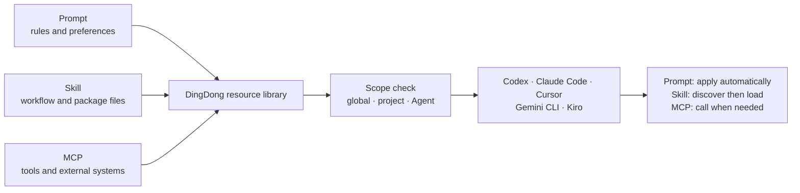

<p align="right">
  <strong>English</strong> · <a href="README.zh.md">简体中文</a>
</p>

<p align="center">
  
</p>

<h1 align="center">DingDong</h1>

<p align="center">
  <strong>Clear clipboard history<br>Manage Prompts, Skills, and MCP in one place<br>Keep connected Agent alerts in one place, with a sound you choose</strong>
</p>

DingDong is a local desktop companion for content-heavy Agent work. It keeps
clipboard history searchable, manages reusable Agent resources in one place,
connects them to supported clients, and gathers their alerts with a desktop
sound you choose. Important results and selected clipboard items can also reach
a trusted phone through the mobile PWA.

At the end of a supported Agent's final reply, DingDong can add a compact
resource receipt: active Prompts, matching Skills, and available MCP connections
stay visible. A `*` marks a Skill loaded or an MCP called during that task.

## What DingDong manages

| Area | What you get |
| --- | --- |
| Clipboard | Searchable text, links, images, files, paths, and commands; groups, matching rules, preview, system open, copy, share, and QR Code |
| Prompt | Full instructions delivered automatically when enabled scope rules match the current task |
| Skill | Complete packages with `SKILL.md`, scripts, references, and assets; summary-first discovery and on-demand loading |
| MCP | One managed server configuration synchronized into matching Agent clients while unrelated configuration is preserved |
| Agent activity | Local completion, blocker, and decision alerts with unread state, repeat counts, history, and a configurable sound |
| Agent reply footer | A compact final-line receipt for active Prompts, matching Skills, and available MCP connections; `*` marks a loaded Skill or called MCP |
| Connected devices | One phone can keep multiple computers paired and online, with per-computer Clipboard, file, draft, and Agent reminder isolation |

Clipboard and resource data stay on this computer by default. The lightweight
connection relay stores no clipboard or file content.

## Unified Prompt, Skill, and MCP management

Maintain each resource once in DingDong. Enable it, place it in a group, and
optionally scope it by workspace path, repository URL, or Agent source.


```mermaid
flowchart LR
  P["Prompt<br/>rules and preferences"] --> D["DingDong resource library"]
  S["Skill<br/>workflow and package files"] --> D
  M["MCP<br/>tools and external systems"] --> D
  D --> B["Scope check<br/>global · project · Agent"]
  B --> A["Codex · Claude Code · Cursor<br/>Gemini CLI · Kiro"]
  A --> R["Prompt: apply automatically<br/>Skill: discover then load<br/>MCP: call when needed"]
```

### Prompt, Skill, and MCP invocation semantics

| Type | DingDong delivery | Agent behavior |
| --- | --- | --- |
| Prompt | `dingdong_bridge` returns every enabled, scope-matched Prompt in full at the start of a task | Treat each successful bridge response as the authoritative replacement snapshot and apply all returned Prompts |
| Skill | The bridge returns the complete matching catalog as ID, name, and description only | Match the description, call `dingdong_load_skill`, then read only referenced package files with `dingdong_read_skill_file` |
| MCP | Enabled servers are synchronized into native client configuration; the bridge returns summary metadata plus stable server provenance | Treat MCP entries as available tools, not instructions; after a real call, send one `dingdong_confirm_mcp_use` receipt so the footer can mark it truthfully |

### A resource receipt at the end of each reply

After the Bridge is connected, supported Agents append one compact resource
line to the final reply, showing the Prompts active for this task, matching
Skills, and available MCP connections:

```text
DingDong · ♥ Project rules | ♦ Release flow* | ♠ GitHub*
```

An `*` after a Skill means the full Skill was loaded during this task; without
it, the Skill is only a candidate. An `*` after an MCP means one of its tools
was actually called; it does not claim the call succeeded. Prompt items stay
unmarked because delivery is observable but semantic compliance is not.
Customize all three symbols under **Settings → Agent reply footer**.

Examples after the corresponding resources are configured:

- “Review this page against our project UI rules and fix the problems.”
- “Use this project's release workflow, run every check, and prepare version 1.4.4.”
- “Use my GitHub tools to find why the latest main workflow failed.”

Agents can also configure project-scoped Skills after explicit user approval with
`dingdong_install_skill`, `dingdong_upsert_trigger_group`, and
`dingdong_bind_resource_scope`.

## Connected devices and mobile PWA

Open **Connected Devices** from the DingDong header or tray menu, show the QR
code, and scan it with a phone. The pairing is retained across page refreshes;
each device can be disconnected, reconnected, or deleted independently. Scan
another computer to add it without replacing the existing pairing. The phone
keeps every computer connected when possible and lets you switch the active
computer from the online status beside the header.

The PWA checks for a fresh application shell while online. Its device settings
also provide a manual upgrade action; applying an update preserves all saved
pairings, so ordinary upgrades do not require scanning the QR code again.

- **Computer → phone:** enable automatic delivery per device to send only new
  clipboard items copied after pairing. Existing history is sent only when you
  choose **Send to Device**.
- **Phone → computer:** the PWA never reads or watches the phone's system
  clipboard. It sends only text you enter or paste, or a file you select, after
  you tap **Send**.
- **Files:** transfers are limited to 25 MB. Computer-hosted items remain
  available only while the source computer and receiving device are connected.
- **Agent reminders:** completion cards include a longer description, source,
  and completion time. Background Web Push and vibration can be enabled per
  device; the operating system still controls whether a notification actually
  vibrates.
- **Mobile navigation:** tap the tabs or swipe horizontally between Computer
  Clipboard and Agent reminders. Tapping a system notification opens Agent
  reminders directly without reloading an already running PWA.
- **Computer isolation:** Clipboard items, Agent events, incoming files, drafts,
  transfer state, and notification diagnostics stay inside their source
  computer. Switching the active computer never mixes or moves those records.
- **Interface icon:** choose the soft-blue or white background in phone
  settings. The installed Home Screen icon is created by the operating system
  and may require removing and re-adding the PWA before it changes.

DingDong attempts a direct WebRTC connection and falls back to its encrypted
relay when necessary. The relay forwards encrypted frames and Web Push payloads
without storing clipboard or file content. Installing the PWA is optional on
Android; on iPhone and iPad, add it to the Home Screen before enabling Web Push.

The Android Chrome path, including background notification delivery, has been
tested end to end. The iPhone/iPad flow follows WebKit's Home Screen Web App
requirements but still needs a recorded real-device release pass.

## Install with an Agent

Paste this into a local Codex, Claude Code, Cursor, Gemini CLI, or Kiro session:

```text
Install DingDong on this computer from https://github.com/JevonsCode/DingDongBuddy. First read and execute https://raw.githubusercontent.com/JevonsCode/DingDongBuddy/main/INSTALL_WITH_AGENT.md. Complete the app installation, MCP setup, completion Hook setup, and both connection tests; preserve all existing user data and unrelated Agent settings. Do not merely summarize the guide.
```

The executable, version-independent procedure lives in
[INSTALL_WITH_AGENT.md](INSTALL_WITH_AGENT.md). It installs an official release;
it does not clone or build the repository.

Manual downloads:

- [macOS · Apple silicon](https://github.com/JevonsCode/DingDongBuddy/releases/latest)
- [macOS · Intel beta](https://github.com/JevonsCode/DingDongBuddy/releases/latest)
- [Windows x64 beta](https://github.com/JevonsCode/DingDongBuddy/releases/latest)

macOS requires version 13 or newer. Quick Paste needs Accessibility permission;
ordinary clipboard history does not require Full Disk Access or Screen Recording.

## Agent compatibility and verification

“Implemented” means a maintained adapter and configuration path exist in this
repository. “Verified” means a real installed client completed the MCP,
completion-hook, and applicable resource-sync paths end to end.

| Agent | MCP configuration | Completion event | Managed bootstrap | Current verification |
| --- | --- | --- | --- | --- |
| Codex | `~/.codex/config.toml` | `Stop` | Prompt Bridge | **Verified end to end on macOS** |
| Claude Code | `~/.claude.json` | `Stop` | Prompt Bridge | **Verified end to end on macOS** |
| Cursor | `~/.cursor/mcp.json` | `afterAgentResponse` | None | Implemented; real-client end-to-end verification wanted |
| Gemini CLI | `~/.gemini/settings.json` | `AfterAgent` | None | Implemented; real-client end-to-end verification wanted |
| Kiro | `~/.kiro/settings/mcp.json` | CLI/IDE Agent Stop | None | Implemented; real-client end-to-end verification wanted |

### How the connection works

DingDong uses two independent native paths:

1. The MCP bridge exposes `dingdong_bridge`, resource tools, configuration
   tools, and `dingdong_notify`.
2. A completion Hook runs `dingdong_mcp --notify-stop --source <agent>`
   after the client produces its final response. No second model call is made.

Automatic setup preserves unrelated entries in native files, including
`~/.codex/config.toml`, `~/.claude/settings.json`,
`~/.cursor/hooks.json`, and `~/.gemini/settings.json`. Codex
may require **Trust & enable** after its executable or MCP configuration changes.
The complete setup and verification matrix is in
[Agent Adapter configuration](docs/product/agent-adapter-configuration.md).

## Default shortcuts and settings

The global panel shortcut and all workspace shortcuts are configurable in
**Settings → Keyboard shortcuts**.

| Action | macOS | Windows |
| --- | --- | --- |
| Open or hide Clipboard | `⌘⇧V` (configurable) | `Ctrl+Shift+V` (configurable) |
| Open Dynamic / Library / Clipboard | `⌃Q` / `⌃W` / `⌃E` (individually configurable) | `Alt+Q` / `Alt+W` / `Alt+E` (individually configurable) |
| Focus search | `⌘F` | `Ctrl+F` |
| Open, reset, or hide filters | `⌘R` | `Ctrl+R` |
| Use visible item 1–9 | `⌘1`–`⌘9` | `Ctrl+1`–`Ctrl+9` |
| Use visible item 1–9 as plain text | `⌥⌘1`–`⌥⌘9` | — |
| Select visible Clipboard group 1–5 | `⌃1`–`⌃5` | `Alt+1`–`Alt+5` |
| Move item / group selection | `↑` / `↓` · `←` / `→` | `↑` / `↓` · `←` / `→` |
| Preview selected item | `Space` | `Space` |
| Use selected item | `Return` | `Enter` |
| Close preview, then hide panel | `Esc` | `Esc` |

| Setting | Default | Options or limits |
| --- | --- | --- |
| Theme | Light | System / Light / Dark |
| Window opacity | 90% | 82%–96% |
| Default workspace | Dynamic | Dynamic / Library / Clipboard |
| Clipboard monitoring | Off | On / off |
| Clipboard retention | 5,000 items, 120 days | 20–5,000 items; 1–730 days |
| Completion sound | DingDong Classic | Built-in, custom, system, or muted |
| Agent reply footer symbols | ♥ / ♦ / ♠ | Customize Prompt, Skill, and MCP separately |
| Local Agent API port | `2333` | `1024`–`65535`; restart required |

## Privacy and local data

- Clipboard history, resources, settings, and Agent activity are local by default.
- The loopback API listens only on localhost.
- Clipboard content access for Agents is off by default; metadata remains available.
- Device-link payloads are end-to-end encrypted; the connection relay does not store clipboard or file content.
- The phone PWA never reads the phone's clipboard and sends content only after an explicit **Send** action.
- Existing client configuration unrelated to DingDong is preserved during sync.
- Issue templates require a privacy check before submission.

## Development

The desktop application uses Flutter 3.44.6 and Dart 3.12 or newer.

```bash
flutter pub get
flutter analyze
flutter test
flutter test integration_test/desktop_agent_connection_smoke_test.dart -d macos
flutter build macos --release
```

Important paths:

- `lib/features/activity/` — Agent activity and unread state
- `lib/features/clipboard/` — capture, classification, search, preview, and sharing
- `lib/features/device_link/` — trusted-device pairing, encrypted transport, Clipboard and file transfer, and Agent delivery
- `lib/features/library/` — Prompt, Skill, MCP, scopes, imports, and native sync
- `lib/features/agent_api/` — loopback API, MCP bridge, and completion Hook
- `device_link_relay/` — lightweight Cloudflare relay and Web Push service
- `docs/app/` — installable mobile PWA
- `docs/` — website, update metadata, release notes, and product documentation

Architecture details live in
[AI companion architecture](docs/architecture/ai-companion-architecture.md).

## Release

`pubspec.yaml` is the version source. A release commit on `main`
must synchronize the app version, build number, MCP server info, website,
`docs/dingdong-release.json`, release notes, regression checklist, and
version-contract tests. After the Flutter desktop workflow passes for the latest
`main` SHA, the release gate also requires the PWA/relay deployed from that exact
commit. Deploy it either through **Device link Cloudflare** after configuring
its protected `device-link-production` environment, or from that clean tested
checkout with authenticated Wrangler and the exact release SHA. Automation then
creates `v<version>` and publishes the signed macOS, Windows
beta, MCP, and update-feed assets. The website is deployed from that release tag
only after its downloadable packages exist.

See [release notes](docs/release-notes.md) and the
[manual regression checklist](docs/product/manual-regression.md).

## License

[MIT](LICENSE)
