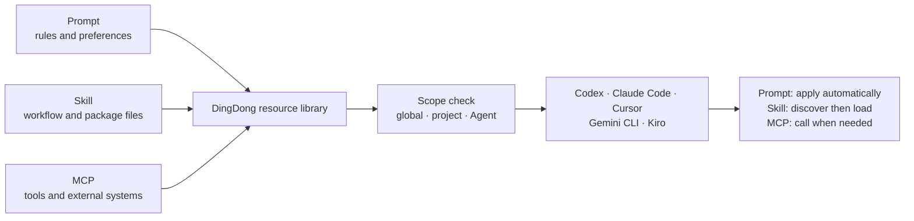

<p align="right">
  <strong>English</strong> · <a href="README.zh.md">简体中文</a>
</p>

<p align="center">
  
</p>

<h1 align="center">DingDong</h1>

<p align="center">
  <strong>Clear clipboard history<br>Manage Prompts, Skills, and MCP in one place<br>DingDong calls you back when your Agent is done</strong>
</p>

DingDong 1.0 is a local desktop companion for content-heavy Agent work. It keeps
clipboard history searchable, manages reusable Agent resources in one place,
connects them to supported clients, and plays a completion sound when an Agent
finishes, gets stuck, or needs a decision.

## What DingDong manages

| Area | What you get |
| --- | --- |
| Clipboard | Searchable text, links, images, files, paths, and commands; groups, matching rules, preview, system open, copy, share, and QR Code |
| Prompt | Full instructions delivered automatically when enabled scope rules match the current task |
| Skill | Complete packages with `SKILL.md`, scripts, references, and assets; summary-first discovery and on-demand loading |
| MCP | One managed server configuration synchronized into matching Agent clients while unrelated configuration is preserved |
| Agent activity | Local completion, blocker, and decision alerts with unread state, repeat counts, history, and a configurable sound |

Clipboard and resource data stay on this computer by default.

## Unified Prompt, Skill, and MCP management

Maintain each resource once in DingDong. Enable it, place it in a group, and
optionally scope it by workspace path, repository URL, or Agent source.


```mermaid
flowchart LR
  P["Prompt<br/>rules and preferences"] --> D["DingDong resource library"]
  S["Skill<br/>workflow and package files"] --> D
  M["MCP<br/>tools and external systems"] --> D
  D --> B["Scope check<br/>global · project · Agent"]
  B --> A["Codex · Claude Code · Cursor<br/>Gemini CLI · Kiro"]
  A --> R["Prompt: apply automatically<br/>Skill: discover then load<br/>MCP: call when needed"]
```

### Prompt, Skill, and MCP invocation semantics

| Type | DingDong delivery | Agent behavior |
| --- | --- | --- |
| Prompt | `dingdong_bridge` returns every enabled, scope-matched Prompt in full at the start of a task | Treat each successful bridge response as the authoritative replacement snapshot and apply all returned Prompts |
| Skill | The bridge returns the complete matching catalog as ID, name, and description only | Match the description, call `dingdong_load_skill`, then read only referenced package files with `dingdong_read_skill_file` |
| MCP | Enabled servers are synchronized into native client configuration; the bridge returns summary metadata | Treat MCP entries as available tools, not instructions, and call a tool only when the task needs it |

Examples after the corresponding resources are configured:

- “Review this page against our project UI rules and fix the problems.”
- “Use this project's release workflow, run every check, and prepare version 1.0.1.”
- “Use my GitHub tools to find why the latest main workflow failed.”

Agents can also configure project-scoped Skills after explicit user approval with
`dingdong_install_skill`, `dingdong_upsert_trigger_group`, and
`dingdong_bind_resource_scope`.

## Install with an Agent

Paste this into a local Codex, Claude Code, Cursor, Gemini CLI, or Kiro session:

```text
Install DingDong on this computer from https://github.com/JevonsCode/DingDongBuddy. First read and execute https://raw.githubusercontent.com/JevonsCode/DingDongBuddy/main/INSTALL_WITH_AGENT.md. Complete the app installation, MCP setup, completion Hook setup, and both connection tests; preserve all existing user data and unrelated Agent settings. Do not merely summarize the guide.
```

The executable, version-independent procedure lives in
[INSTALL_WITH_AGENT.md](INSTALL_WITH_AGENT.md). It installs an official release;
it does not clone or build the repository.

Manual downloads:

- [macOS · Apple silicon](https://github.com/JevonsCode/DingDongBuddy/releases/latest)
- [macOS · Intel beta](https://github.com/JevonsCode/DingDongBuddy/releases/latest)
- [Windows x64 beta](https://github.com/JevonsCode/DingDongBuddy/releases/latest)

macOS requires version 13 or newer. Quick Paste needs Accessibility permission;
ordinary clipboard history does not require Full Disk Access or Screen Recording.

## Agent compatibility and verification

“Implemented” means a maintained adapter and configuration path exist in this
repository. “Verified” means a real installed client completed the MCP,
completion-hook, and applicable resource-sync paths end to end.

| Agent | MCP configuration | Completion event | Managed bootstrap | Current verification |
| --- | --- | --- | --- | --- |
| Codex | `~/.codex/config.toml` | `Stop` | Prompt Bridge | **Verified end to end on macOS** |
| Claude Code | `~/.claude.json` | `Stop` | Prompt Bridge | **Verified end to end on macOS** |
| Cursor | `~/.cursor/mcp.json` | `afterAgentResponse` | None | Implemented; real-client end-to-end verification wanted |
| Gemini CLI | `~/.gemini/settings.json` | `AfterAgent` | None | Implemented; real-client end-to-end verification wanted |
| Kiro | `~/.kiro/settings/mcp.json` | CLI/IDE Agent Stop | None | Implemented; real-client end-to-end verification wanted |

### How the connection works

DingDong uses two independent native paths:

1. The MCP bridge exposes `dingdong_bridge`, resource tools, configuration
   tools, and `dingdong_notify`.
2. A completion Hook runs `dingdong_mcp --notify-stop --source <agent>`
   after the client produces its final response. No second model call is made.

Automatic setup preserves unrelated entries in native files, including
`~/.codex/config.toml`, `~/.claude/settings.json`,
`~/.cursor/hooks.json`, and `~/.gemini/settings.json`. Codex
may require **Trust & enable** after its executable or MCP configuration changes.
The complete setup and verification matrix is in
[Agent Adapter configuration](docs/product/agent-adapter-configuration.md).

## Default shortcuts and settings

The global panel shortcut and all workspace shortcuts are configurable in
**Settings → Keyboard shortcuts**.

| Action | macOS | Windows |
| --- | --- | --- |
| Open or hide Clipboard | `⌘⇧V` (configurable) | `Ctrl+Shift+V` (configurable) |
| Open Dynamic / Library / Clipboard | `⌃Q` / `⌃W` / `⌃E` (individually configurable) | `Alt+Q` / `Alt+W` / `Alt+E` (individually configurable) |
| Focus search | `⌘F` | `Ctrl+F` |
| Open, reset, or hide filters | `⌘R` | `Ctrl+R` |
| Use visible item 1–9 | `⌘1`–`⌘9` | `Ctrl+1`–`Ctrl+9` |
| Preview / use selected item | `Space` / `Return` | `Space` / `Enter` |
| Close preview, then hide panel | `Esc` | `Esc` |

| Setting | Default | Options or limits |
| --- | --- | --- |
| Theme | Light | System / Light / Dark |
| Window opacity | 90% | 82%–96% |
| Default workspace | Dynamic | Dynamic / Library / Clipboard |
| Clipboard monitoring | Off | On / off |
| Clipboard retention | 5,000 items, 120 days | 20–5,000 items; 1–730 days |
| Completion sound | DingDong Classic | Built-in, custom, system, or muted |
| Local Agent API port | `2333` | `1024`–`65535`; restart required |

## Privacy and local data

- Clipboard history, resources, settings, and Agent activity are local by default.
- The loopback API listens only on localhost.
- DingDong does not include analytics or telemetry.
- Clipboard content access for Agents is off by default; metadata remains available.
- Existing client configuration unrelated to DingDong is preserved during sync.
- Issue templates require a privacy check before submission.

## Development

The desktop application uses Flutter 3.44.6 and Dart 3.12 or newer.

```bash
flutter pub get
flutter analyze
flutter test
flutter test integration_test/desktop_agent_connection_smoke_test.dart -d macos
flutter build macos --release
```

Important paths:

- `lib/features/activity/` — Agent activity and unread state
- `lib/features/clipboard/` — capture, classification, search, preview, and sharing
- `lib/features/library/` — Prompt, Skill, MCP, scopes, imports, and native sync
- `lib/features/agent_api/` — loopback API, MCP bridge, and completion Hook
- `docs/` — website, update metadata, release notes, and product documentation

Architecture details live in
[AI companion architecture](docs/architecture/ai-companion-architecture.md).

## Release

`pubspec.yaml` is the version source. A release commit on `main`
must synchronize the app version, build number, MCP server info, website,
`docs/dingdong-release.json`, release notes, regression checklist, and
version-contract tests. After the Flutter desktop workflow passes for the latest
`main` SHA, automation creates `v<version>` and publishes the
signed macOS, Windows beta, MCP, and update-feed assets.

See [release notes](docs/release-notes.md) and the
[manual regression checklist](docs/product/manual-regression.md).

## License

[MIT](LICENSE)
