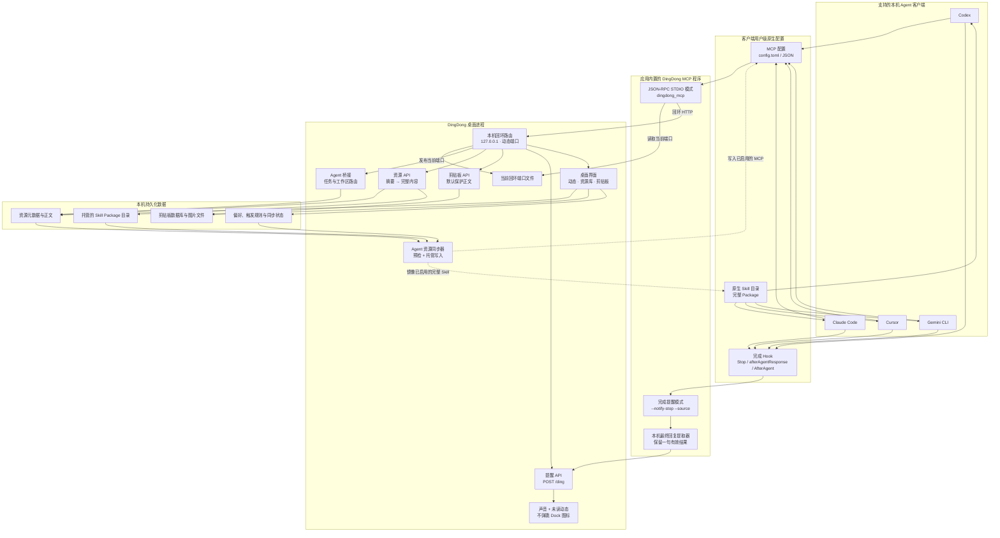

<p align="right">
  <a href="README.md">English</a> · <strong>简体中文</strong>
</p>

<p align="center">
  
</p>

<h1 align="center">DingDong</h1>

<p align="center">
  <strong>把剪贴板和 Agent 工具收在一起，工作做好了就叮咚。</strong>
</p>

DingDong 把剪贴板历史、提示词、Skill 和 MCP Server 留在本机，并接到常用的
编程 Agent 上。Agent 做完、卡住或等你决定时，它会带着一句本轮结果把你叫回来，
不用一直盯着聊天窗口。

## 能做什么

- 找回之前复制过的文本、链接、图片、文件和命令
- 用分组和自定义匹配规则整理剪贴板历史
- 在一个资源库里保存提示词、完整 Skill Package 和 MCP 配置
- 从线上安装整个 Skill 目录，包括 `scripts/`、`references/` 和 `assets/`，
  需要时再手动更新
- 把已启用的 Skill 和 MCP 同步到 Codex、Claude Code、Cursor 和 Gemini CLI，
  同时保留客户端原有配置
- 按工作区路径或仓库地址决定一组资源什么时候生效
- 先让 Agent 看到简短名称和描述，确实要用时再读取完整内容
- 在 Agent 原生的完成事件上稳定提醒；客户端能提供最终回复时，通知里会显示
  第一条有用的结果
- 剪贴板和资源数据默认只保存在你的电脑上

## 下载

- [macOS · Apple Silicon](https://github.com/JevonsCode/DingDongBuddy/releases/latest)
- [macOS · Intel（beta）](https://github.com/JevonsCode/DingDongBuddy/releases/latest)
- [Windows x64（beta）](https://github.com/JevonsCode/DingDongBuddy/releases/latest)

macOS 下载 `.dmg` 后，把 **DingDong** 拖到 **Applications**。快捷粘贴需要
辅助功能权限；普通剪贴板历史不需要完全磁盘访问或屏幕录制权限。

## Agent 接入是怎么工作的

DingDong 使用两条原生链路，不依赖模型每次结束时“记得说一句”：

1. **MCP 桥接**：给 Agent 提供 `dingdong_bridge`、资源读取和
   `dingdong_notify` 等工具。
2. **完成 Hook**：在客户端最终回复后确定性执行一次。内置程序直接从 Hook
   数据或本地会话记录里截取一句结果，不会额外调用一次模型。

这两条接入链路和用户在 DingDong 里启用的资源是两回事。已启用的 Skill 会作为
完整目录同步到客户端原生 Skill 位置；已启用的 MCP 会写成真实的客户端 MCP 配置；
资源分组规则目前用于缩小 `dingdong_bridge` 返回的候选范围，原生 Skill 和 MCP
同步仍以资源的“已启用”状态为准。

### 详细架构



三条主要运行路径是：

- **任务开始**：Agent → `dingdong_bridge` → 有界的名称与描述 → 需要时再读取
  完整资源。
- **启用资源**：资源库启用状态 → 预检 → 原生 Skill 目录或 MCP 配置，使用
  DingDong 托管标记避免误删用户文件。项目规则在 `dingdong_bridge` 为任务路由
  资源时单独生效。
- **任务结束**：客户端完成 Hook → `--notify-stop` → 本机提取一句结果 →
  `/ding` → 声音和动态记录。

## 接入 Agent

使用桥接时需要保持 DingDong 运行。这是本机接入：云端 Agent 无法执行你电脑上的
文件路径，也无法访问本机回环 API。

打开 **DingDong → Agent API → MCP 接入**，复制界面显示的可执行文件路径。
macOS 正常安装后的路径是：

```text
/Applications/DingDong.app/Contents/MCP/bundle/bin/dingdong_mcp
```

Windows 的桥接位于应用安装目录下的 `mcp\bundle\bin\dingdong_mcp.exe`。安装
目录可能不同，应直接复制 DingDong 显示的完整路径，不要手写猜测。

### 自动接入（推荐）

在 **MCP 接入** 中点击 **复制**，把生成的提示词发给要接入的本机 Agent，让它修改
自己的用户级配置。流程会分别测试完成 Hook 和 `dingdong_notify`，不会只看 MCP
工具是否出现。

应用生成的提示词带有当前平台的真实路径，是唯一的标准版本。下面的模板与它使用
同一套流程；手动复制模板时，把 `<DINGDONG_MCP_PATH>` 换成应用里复制的路径：

```text
请把这台电脑上的 DingDong 接入当前 Agent 或 IDE。
1. 确认 <DINGDONG_MCP_PATH> 存在并可执行；如果当前是远程或云端会话就停止接入。
2. 保留所有无关用户配置，新增名为 dingdong 的全局 STDIO MCP Server。command 必须是完整的 <DINGDONG_MCP_PATH>，不要给 MCP 添加 args、env 或外层 shell。
3. 添加且只添加一个持久的原生完成 Hook，执行：
   "<DINGDONG_MCP_PATH>" --notify-stop --source "当前客户端名称"
   Codex 使用 ~/.codex/config.toml 的 Stop，Claude Code 使用 ~/.claude/settings.json 的 Stop，Cursor 使用 ~/.cursor/hooks.json 的 afterAgentResponse，Gemini CLI 使用 ~/.gemini/settings.json 的 AfterAgent。
4. 重新加载客户端。Codex 需要重启 MCP Server，并在 /hooks 审核和信任 Hook。
5. 把 {"summary":"DingDong 任务结束提醒已接入"} 作为标准输入传给 Hook 命令，确认收到提醒。
6. 确认 dingdong_notify 存在，再调用一次：message 为“DingDong MCP 已接入”，source 为当前客户端名称。
7. 最后只报告修改的用户级配置文件和两项测试是否成功；失败时保留原配置并返回原始错误。
```

### 手动接入

下面都是需要合并到现有文件的配置片段，不能用它覆盖整个配置文件。JSON 里的
Windows 反斜杠需要写成 `\\`。

#### 1. 添加 DingDong MCP Server

**Codex — `~/.codex/config.toml`**

```toml
[mcp_servers.dingdong]
command = "/absolute/path/to/dingdong_mcp"
```

**Claude Code — 用户级**

```bash
claude mcp add --transport stdio --scope user dingdong -- "/absolute/path/to/dingdong_mcp"
claude mcp list
```

Claude Code 会把用户级 MCP 保存在 `~/.claude.json`。

**Cursor — `~/.cursor/mcp.json`**

```json
{
  "mcpServers": {
    "dingdong": {
      "command": "/absolute/path/to/dingdong_mcp"
    }
  }
}
```

**Gemini CLI — `~/.gemini/settings.json`**

```json
{
  "mcpServers": {
    "dingdong": {
      "command": "/absolute/path/to/dingdong_mcp"
    }
  }
}
```

#### 2. 添加原生完成 Hook

Hook 使用同一个可执行文件，但和 MCP Server 不同，它需要带上
`--notify-stop` 参数。

**Codex — 合并到 `~/.codex/config.toml`**

```toml
[features]
hooks = true

[[hooks.Stop]]

[[hooks.Stop.hooks]]
type = "command"
command = '"/absolute/path/to/dingdong_mcp" --notify-stop --source "Codex"'
timeout = 10
```

重新加载 Codex 后打开 `/hooks`，信任新增的 Hook。以后路径或命令有变化时，Hook
哈希也会变化，需要重新信任。

**Claude Code — 追加到 `~/.claude/settings.json` 的 `hooks.Stop`**

```json
{
  "hooks": {
    "Stop": [
      {
        "hooks": [
          {
            "type": "command",
            "command": "\"/absolute/path/to/dingdong_mcp\" --notify-stop --source \"Claude Code\"",
            "timeout": 10
          }
        ]
      }
    ]
  }
}
```

用 `/hooks` 检查加载到的定义。

**Cursor — 追加到 `~/.cursor/hooks.json`**

```json
{
  "version": 1,
  "hooks": {
    "afterAgentResponse": [
      {
        "command": "\"/absolute/path/to/dingdong_mcp\" --notify-stop --source \"Cursor\""
      }
    ]
  }
}
```

修改后重新加载 Cursor 窗口。需要使用能访问本机 DingDong 应用的本地 Agent 会话。

**Gemini CLI — 追加到 `~/.gemini/settings.json` 的 `hooks.AfterAgent`**

```json
{
  "hooks": {
    "AfterAgent": [
      {
        "hooks": [
          {
            "name": "dingdong-completion",
            "type": "command",
            "command": "\"/absolute/path/to/dingdong_mcp\" --notify-stop --source \"Gemini CLI\"",
            "timeout": 10000
          }
        ]
      }
    ]
  }
}
```

用 `/hooks panel` 检查 Hook。

#### 3. 分别验证两条链路

macOS 或 Linux 先直接测试 Hook：

```bash
printf '%s' '{"summary":"DingDong completion hook is connected"}' \
  | "/absolute/path/to/dingdong_mcp" --notify-stop --source "Codex"
```

PowerShell：

```powershell
'{"summary":"DingDong completion hook is connected"}' |
  & "C:\absolute\path\to\dingdong_mcp.exe" --notify-stop --source "Codex"
```

命令会返回 `{}`，同时 DingDong 应响铃。然后重新加载 MCP Server，确认
`dingdong_notify` 出现在工具列表并调用一次。只看到 MCP 工具不代表完成 Hook 已经
安装，所以两项都必须测试。

### 客户端对应关系

| 客户端 | MCP 位置 | 完成 Hook | 一句话结果来源 |
| --- | --- | --- | --- |
| Codex | `~/.codex/config.toml` | `Stop` | 本地会话记录里的 final answer |
| Claude Code | `~/.claude.json` | `~/.claude/settings.json` 中的 `Stop` | `last_assistant_message` |
| Cursor | `~/.cursor/mcp.json` | `~/.cursor/hooks.json` 中的 `afterAgentResponse` | 回复 `text` |
| Gemini CLI | `~/.gemini/settings.json` | 同一文件中的 `AfterAgent` | `prompt_response` |

上游文档：[Codex MCP](https://learn.chatgpt.com/docs/extend/mcp?surface=cli)、
[Codex Hooks](https://learn.chatgpt.com/docs/hooks)、
[Claude Code MCP](https://code.claude.com/docs/en/mcp)、
[Claude Code Hooks](https://code.claude.com/docs/en/hooks)、
[Cursor MCP](https://cursor.com/docs/context/model-context-protocol)、
[Cursor Hooks](https://cursor.com/docs/hooks)、
[Gemini CLI MCP](https://geminicli.com/docs/tools/mcp-server/) 和
[Gemini CLI Hooks](https://geminicli.com/docs/hooks/reference/)。

## 隐私与本机数据

- macOS：`~/Library/Application Support/DingDong`
- Windows：`%APPDATA%\DingDong`

HTTP Server 只绑定 `127.0.0.1`。默认优先使用 `2333` 端口；占用时，DingDong
会把实际端口写到应用数据目录，内置桥接会自动重连。剪贴板接口默认不返回完整或
敏感正文，除非调用方明确请求支持的内容模式。

DingDong 不包含统计或用户行为埋点。提交问题前，请删掉剪贴板正文、密钥、个人或
公司信息、用户名和本机路径。

## 开发

### 桌面支持

- macOS 13 及以上，Apple Silicon 与 Intel
- Windows 10 及以上
- 项目工具链：Flutter 3.44.6 / Dart 3.12

### 构建和测试

```bash
flutter pub get
flutter analyze
flutter test
flutter run -d macos
```

Windows 使用 `flutter run -d windows`。Release 构建会把完整 MCP 桥接 Bundle
编译进应用分发包：

```bash
flutter build macos --release
flutter build windows --release
```

为了让 macOS 本地升级保持同一签名身份，第一次创建稳定的开发签名，之后每个
Release Bundle 安装前重新封装签名：

```bash
scripts/setup_macos_codesigning.sh
scripts/sign_macos_bundle.sh build/macos/Build/Products/Release/DingDong.app
```

### 项目结构

```text
lib/
  app/                 组合根、数据路径、本地化、主题
  core/                共用模型和平台协议
  features/
    agent_api/         回环 API、MCP 桥接、Hook、Agent 路由
    clipboard/         采集、分类、历史、快捷粘贴
    library/           资源、Skill Package、同步、导入导出
    settings/          偏好、版本和桌面设置
    shell/             导航、托盘和全局桌面命令
    activity/          Agent 动态和任务结果
  platform/            macOS 与 Windows 适配
bin/dingdong_mcp.dart  STDIO 与完成 Hook 的内置入口
macos/                 macOS 应用宿主
windows/               Windows 应用宿主
test/                  单元、契约、组件、性能和 Golden 测试
```

### 主要回环接口

- `GET /health`
- `POST /ding`
- `GET|POST /library`
- `GET /library/export`
- `POST /library/import`
- `GET /clipboard/history`
- `POST /clipboard/capture`
- `POST /clipboard/restore/{id}`
- `GET|POST /agent/bridge`
- `GET /agent/manifest`

## 发布

推送 `v*.*.*` Tag 会运行 `.github/workflows/release.yml`，测试并构建 macOS
Apple Silicon、macOS Intel 和 Windows x64 包，再发布 GitHub Release。配置 Apple
分发密钥后会执行 Developer ID 签名、公证和 Staple；否则 CI 生成临时签名的社区包。

## 许可证

MIT，见 [LICENSE](LICENSE)。
