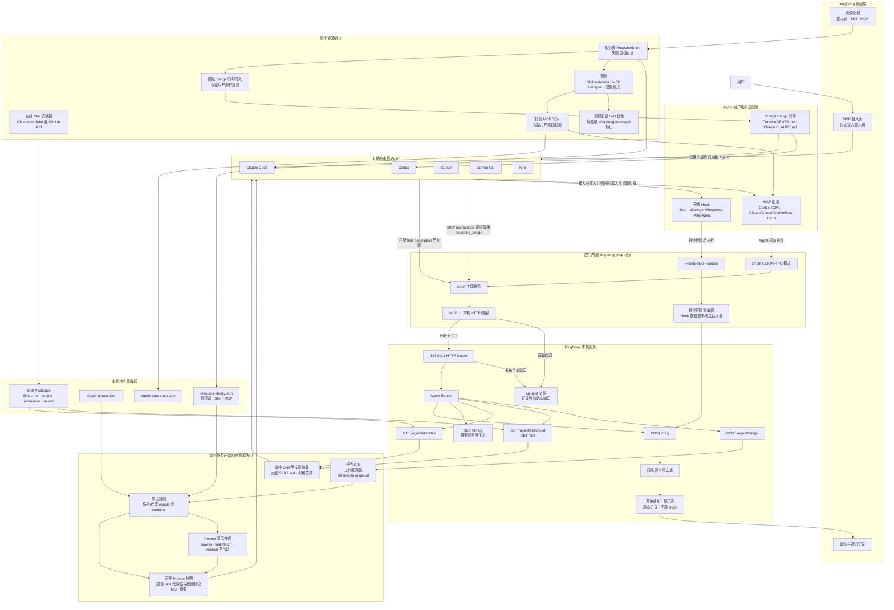

<p align="right">
  <a href="README.md">English</a> · <strong>简体中文</strong>
</p>

<p align="center">
  
</p>

<h1 align="center">DingDong</h1>

<p align="center">
  <strong>把剪贴板和 Agent 工具收在一起，工作做好了就叮咚。</strong>
</p>

DingDong 把剪贴板历史、提示词、Skill 和 MCP Server 留在本机，并接到常用的
编程 Agent 上。Agent 做完、卡住或等你决定时，它会带着一句本轮结果把你叫回来，
不用一直盯着聊天窗口。

## 让 Agent 直接安装

在本机 Codex、Claude Code、Cursor、Gemini CLI 或 Kiro 会话中粘贴下面这句话即可。Agent
会选择正确平台的官方安装包、启动 DingDong、接入 MCP Bridge 和原生完成 Hook，并
分别验证两条链路。

```text
请从 https://github.com/JevonsCode/DingDongBuddy 在这台电脑上安装 DingDong。先读取并执行 https://raw.githubusercontent.com/JevonsCode/DingDongBuddy/main/INSTALL_WITH_AGENT.md，完成应用安装、MCP 接入、完成 Hook 接入和两项连接测试；保留所有现有用户数据与无关的 Agent 配置，不要只复述说明。
```

完整且不绑定具体版本的权威流程位于
[INSTALL_WITH_AGENT.md](INSTALL_WITH_AGENT.md)。当用户明确要求安装时，即使只把仓库
链接发给本机 Agent，Agent 也应从 README 找到并执行这份说明，不需要克隆或编译源码。

## 能做什么

- 找回之前复制过的文本、链接、图片、文件和命令
- 用分组和自定义匹配规则整理剪贴板历史
- 在一个资源库里保存提示词、完整 Skill Package 和 MCP 配置
- 从 GitHub 或本机路径安装整个 Skill 目录，包括 `scripts/`、`references/` 和
  `assets/`，需要时再手动更新
- 在 Codex `~/.codex/AGENTS.md` 与 Claude Code
  `~/.claude/CLAUDE.md` 中只保留固定 Bridge 引导，同时保留原有用户规则
- 把已启用、作用域匹配的 Skill 作为动态名称／描述目录发布；Agent 选中后才按需
  加载完整 `SKILL.md` 和它引用的 Package 文件
- 把已启用的 MCP 同步到 Codex、Claude Code、Cursor、Gemini CLI 和 Kiro，
  同时保留客户端原有配置
- 按工作区路径或仓库地址缩小每个任务的桥接候选范围
- 默认给 Agent 完整 Prompt；Skill 提供完整名称／描述目录，MCP 先提供摘要，
  确实要用时再加载或调用
- 在 Agent 原生的完成事件上稳定提醒；客户端能提供最终回复时，通知里会显示
  第一条有用的结果
- 持久保存托盘未读数，重启应用不会丢失未查看的完成提醒
- 在本机保存可配置、只读的 Agent 完成详情历史
- 剪贴板和资源数据默认只保存在你的电脑上

### Agent 兼容性与实测状态

“已实现”表示仓库中已有对应客户端适配器和配置路径；“已验证”表示使用真实安装的
客户端，把 MCP、完成 Hook 和适用的资源同步链路完整跑通。两者分开记录，避免把
代码支持表述成对所有客户端版本和操作系统的完整保证。

| Agent | MCP 配置 | 完成通知 | 托管的原生引导 | 当前验证状态 |
| --- | --- | --- | --- | --- |
| Codex | `~/.codex/config.toml` | `Stop` | Prompt Bridge | **已在 macOS 端到端验证** |
| Claude Code | `~/.claude.json` | `Stop` | Prompt Bridge | **已在 macOS 端到端验证** |
| Cursor | `~/.cursor/mcp.json` | `afterAgentResponse` | 无 | 已实现；待真实客户端端到端验证 |
| Gemini CLI | `~/.gemini/settings.json` | `AfterAgent` | 无 | 已实现；待真实客户端端到端验证 |
| Kiro | `~/.kiro/settings/mcp.json` | CLI `stop` / IDE Agent Stop | 无 | 已实现；待真实客户端端到端验证 |

所有自动生效的 Prompt 和权威 Skill 目录都会通过 `dingdong_bridge` 提供给已连接
客户端；“托管的原生引导”一列只列 DingDong 写入客户端原生指令文件的固定 Bridge
说明，托管 Skill 保留在 DingDong 内并按需加载。要把一行更新为 **已验证**，PR 中
应注明操作系统、客户端版本，并确认 MCP Bridge、完成 Hook 和适用的引导同步链路。

## 当前界面行为

- 页头在 **DingDong** 右侧显示当前应用版本，例如 `v0.9.4`；版本值和应用的
  发布版本共用同一个常量。检测到新版本时，右侧会出现一个橘红色小圆点。点击版本号
  会打开设置，并直接定位到版本与更新区域。
- 点击页头 **DingDong** 会试听用户当前配置的提示音；静音配置不会播放。品牌名和
  版本号都不显示悬停提示或悬停背景。
- 动态页的“剪贴板”数字来自界面最近一次载入的全部剪贴板记录，不受搜索、类型、
  分类或分组筛选影响，最多统计最近 5000 条。
- 开启剪贴板监听后，原生变化序号约每 250ms 检查一次并写入本机 SQLite；数字卡片
  目前不是严格实时订阅，启动界面、点击刷新、进入剪贴板页或显式捕获后才会重载。
- 进入剪贴板页只重载本地历史，不会把系统剪贴板当前内容再次采集；因此删掉最后一条
  后不会因为切换页面而重新出现。新复制内容仍由监听或“立即捕获”写入。
- 拖动调整的剪贴板分组顺序会独立于条目归属持久保存，重新打开剪贴板或资源管理窗口
  时继续沿用用户排好的顺序。
- 剪贴板自动保留默认上限为 5000 条未归档记录、120 天；置顶和归档记录均不计入限制。
- 复制图片文件时只保存源文件路径，DingDong 不会再复制一份；源文件被移动或删除后，
  对应历史记录将无法预览或恢复。截图等没有源文件路径的图片数据会持久化到
  `Clipboard Images`，并遵守相同的条数和天数上限；记录置顶或归档时，其托管图片
  也会继续保留。
- “最近 Agent”标题旁显示克制的滚动时间窗口计数，默认统计近 24 小时；完成详情默认
  保留最近 500 条并跨重启记忆，也可在资源管理中以只读列表查看。是否跨重启保留、
  详情上限和计数小时数都可在设置中调整。
- 托盘未读数只有在点击托盘、面板实际显示约 0.5 秒后才确认；确认期间新到达的提醒
  会继续保留，并且未读状态会跨应用重启恢复。
- 确认、输入和管理类弹窗共用紧凑桌面规范：14px 圆角、细边框、低阴影、克制的
  标题层级和非胶囊按钮；删除等危险操作使用统一危险色。
- 设置检测到新版本后，点击 **更新到…** 会一次完成下载、签名校验、事务式替换、
  清理旧文件和重启。macOS 使用 Sparkle 2；Windows 使用按用户安装的 Velopack，
  不需要管理员权限。

## 默认快捷键和设置

系统级的 **打开或隐藏剪贴板** 快捷键和三个面板内工作区快捷键，都可以在
**设置 → 键盘快捷键** 中修改。点击当前快捷键后直接按下新组合，录入后立即生效。
组合必须至少包含一个修饰键，主键可使用字母、数字、F1–F12、方向键、空格或回车。
如果新组合与其他工作区、现有 DingDong 操作、系统保留操作冲突，或全局快捷键无法
注册，DingDong 会继续使用原来的快捷键。

| 操作 | macOS | Windows |
| --- | --- | --- |
| 打开或隐藏剪贴板 | `⌘⇧V`（可配置） | `Ctrl+Shift+V`（可配置） |
| 打开动态 / 资源库 / 剪贴板 | `⌃Q` / `⌃W` / `⌃E`（可分别配置） | `Alt+Q` / `Alt+W` / `Alt+E`（可分别配置） |
| 聚焦剪贴板搜索 | `⌘F` | `Ctrl+F` |
| 展开、重置或收起剪贴板筛选 | `⌘R` | `Ctrl+R` |
| 使用当前可见的第 1–9 条剪贴板 | `⌘1`–`⌘9` | `Ctrl+1`–`Ctrl+9` |
| 以纯文本使用当前可见的第 1–9 条 | `⌥⌘1`–`⌥⌘9` | — |
| 移动剪贴板选择 | `↑` / `↓` | `↑` / `↓` |
| 预览选中条目 | `空格` | `空格` |
| 使用选中条目 | `回车` | `Enter` |
| 先关闭预览，再隐藏面板 | `Esc` | `Esc` |

设置保存在本机；除特别说明外，修改后立即生效：

| 设置项 | 默认值 | 可选值或范围 |
| --- | --- | --- |
| 打开或隐藏剪贴板 | `⌘⇧V` | 可自定义；Windows 默认 `Ctrl+Shift+V` |
| 开机启动 | 关闭 | 开启 / 关闭 |
| 隐藏 Dock 图标（macOS） | 关闭 | 开启 / 关闭 |
| 语言 | 跟随系统 | 跟随系统 / English / 中文 |
| 主题 | 浅色 | 跟随系统 / 浅色 / 深色 |
| 窗口透明度 | 90% | 82%–96% |
| 列表密度 | 舒展 | 舒展 / 紧凑 |
| 默认页面 | 动态 | 动态 / 资源库 / 剪贴板 |
| 剪贴板监听 | 关闭 | 开启 / 关闭 |
| 剪贴板保留 | 5000 条、120 天 | 20–5000 条；1–730 天 |
| 允许 Agent 读取剪贴板正文 | 关闭 | 开启 / 关闭；关闭时元数据仍可用 |
| 跨重启保留最近 Agent | 开启 | 开启 / 关闭 |
| 最近 Agent 上限 | 500 条详情、24 小时计数 | 1–5000 条；1–8760 小时 |
| 完成提示音 | 经典叮咚 | 经典、柔和、清亮、利落、低沉、自定义文件、系统声音或静音 |
| 菜单栏提醒颜色（macOS） | 橙黄 | 橙黄 / 粉色 / 蓝色 / 绿色 / 紫色 |
| 本地 Agent API 端口 | `2333` | `1024`–`65535`；修改后需要重启 |

## 下载

- [macOS · Apple Silicon](https://github.com/JevonsCode/DingDongBuddy/releases/latest)
- [macOS · Intel（beta）](https://github.com/JevonsCode/DingDongBuddy/releases/latest)
- [Windows x64（beta）](https://github.com/JevonsCode/DingDongBuddy/releases/latest)

macOS 下载 `.dmg` 后，把 **DingDong** 拖到 **Applications**。快捷粘贴需要
辅助功能权限；普通剪贴板历史不需要完全磁盘访问或屏幕录制权限。

首个内置更新器版本是一次迁移边界。现有 macOS/ZIP 版用户需要手动安装该版本一次；
Windows 用户需要先运行一次 Velopack 的 `Setup.exe`。从下一版开始即可在设置中
一键更新。Windows 便携版不提供自更新。

## Agent 接入是怎么工作的

DingDong 使用两条原生链路，不依赖模型每次结束时“记得说一句”：

1. **MCP 桥接**：给 Agent 提供 `dingdong_bridge`、资源读取、
   `dingdong_install_skill` 等配置工具和 `dingdong_notify`。
2. **完成 Hook**：在客户端最终回复后确定性执行一次。内置程序直接从 Hook
   数据或本地会话记录里截取一句结果，不会额外调用一次模型。

这两条接入链路和用户在 DingDong 里启用的资源是两回事。Codex
`~/.codex/AGENTS.md` 与 Claude Code `~/.claude/CLAUDE.md` 只保留一段固定引导，
要求每个任务开始调用 `dingdong_bridge`。Bridge 动态返回命中的全局、项目和任务
Prompt 完整正文；每次成功响应都是当前任务的权威快照，Manual Prompt 不会自动激活。
同一响应还会返回所有有效、已启用且作用域匹配 Skill 的权威完整目录，且每项只有 `id`、
`name` 和 `description`。Agent 选中后再按 ID 或名称通过 DingDong 加载完整
`SKILL.md` 及其引用文件。同一响应还会返回所有已激活且作用域匹配的 MCP 与
Knowledge 候选摘要。DingDong 不再把托管 Skill 复制到 Agent 原生 Skill 目录。
已启用的 MCP 会写成真实的客户端 MCP 配置。

### Prompt、Skill 和 MCP 的调用逻辑

| 类型 | 如何进入 Agent | Agent 应如何处理 |
|---|---|---|
| Prompt | 原生指令文件只保留固定 Bridge 引导；启用的全局、项目和任务 Prompt 由 `dingdong_bridge` 动态返回完整正文 | 每个任务开始调用 Bridge，把成功响应视为替换此前集合的权威 Prompt 快照，并自动应用全部返回内容 |
| Skill | 每次 Bridge 成功响应都返回所有有效、已启用且作用域匹配 Skill 的权威完整目录，每项只有 `id`、`name` 和 `description`；完整 Package 留在 DingDong | 先判断已返回的 description，匹配后按 ID 或名称调用 `dingdong_load_skill` 并应用完整 `SKILL.md`；只通过 `dingdong_read_skill_file` 读取它引用的文件；候选本身不是指令，未返回即表示当前不可用、已停用、格式无效或不在作用域内 |
| MCP | 已启用 MCP 写入客户端原生 MCP 配置；Bridge 只返回候选摘要 | 配置只表示工具可用，任务确实需要时才调用对应工具；不要求每轮调用 |

Prompt 的激活方式和触发组控制 Prompt 返回；Skill 候选由启用状态和触发组过滤，
完整正文与文件加载时会再次校验相同条件。MCP 仍是客户端全局配置。

### 给一个项目配置 Skill

用户明确要求修改后，Agent 可以直接完成整套配置，不需要用户再打开资源管理：

1. `dingdong_install_skill` 从 GitHub 地址或绝对本机 Skill 路径安装或更新完整包。
2. `dingdong_upsert_trigger_group` 用已存在项目的精确绝对路径创建或复用触发组。
3. `dingdong_bind_resource_scope` 用返回的两个 ID 绑定，并设置
   `strictProjectSkill: true`；这个兼容字段现在表示严格动态加载范围，而不是原生文件
   部署。
4. 用 `dingdong_bridge` 和 `dingdong_load_skill` 分别验证一个命中工作区和一个
   无关工作区。

这三个写操作都是幂等的。严格绑定只接受精确项目路径规则，会拒绝 `contains`、仓库
规则、相对路径、磁盘根目录、不存在的路径和未知触发组。完整 Package 保留在
DingDong Package Store；命中工作区可以动态发现并加载，无关工作区不能。

通过 MCP 新安装的 Skill 会保持禁用，直到范围绑定成功，因此不会在多步操作中短暂
进入动态目录。用户在 Agent 原生目录里独立安装的 Skill 不归 DingDong 控制，
DingDong 的开关不能隐藏或删除它。

DingDong 资源库与内部 Package Store 是托管 Skill 的单一来源。同步时只会清理带
`.dingdong-managed` 标记的旧版原生副本，不会删除用户独立安装的 Skill。同名原生
Skill 或已启用的 Claude Code 插件会显示非阻断警告，因为它们仍在 DingDong 开关之外
可用。多个已启用的 DingDong Skill 使用同一个名称时也会警告；Agent 加载时必须同时
带目录中的 `id` 来消除歧义。

主窗口的问题图标会进入资源管理的“问题”一级页面，可按客户端、资源和路径查看诊断、
跳转处理或手动检测。客户端路径和能力集中登记在可扩展的 Agent Adapter 中；Skill
路径只用于清理旧版托管镜像和检查独立原生 Skill 冲突，不再是部署目标。用户可在
**资源管理 → Agent 接入** 默认查看证据摘要：YAML 是否有效、Agent 目录是否检测到，
以及 MCP、Prompt、Skill 路径是否声明；这些信号都不表示 MCP、Hook 或 Bridge 已连接。
YAML 编辑及当前版与前两个版本对比位于 **高级配置**，外部 Agent 修改用户 YAML 后
页面也会自动刷新。完整字段与安全修改协议见
[Agent Adapter 配置](docs/product/agent-adapter-configuration.md)。

### 详细架构


```mermaid
flowchart TB
  User["用户"]

  subgraph UI["DingDong 桌面端"]
    SetupUI["MCP 接入页<br/>只读接入提示词"]
    ResourceUI["资源管理<br/>提示词 · Skill · MCP"]
    ActivityUI["动态与通知记录"]
  end

  subgraph Clients["支持的本机 Agent"]
    Codex["Codex"]
    Claude["Claude Code"]
    Cursor["Cursor"]
    Gemini["Gemini CLI"]
    Kiro["Kiro"]
  end

  User --> SetupUI
  SetupUI -->|"把接入提示词交给 Agent"| Clients

  subgraph NativeConfig["Agent 用户级原生配置"]
    McpConfig["MCP 配置<br/>Codex TOML · Claude/Cursor/Gemini/Kiro JSON"]
    HookConfig["完成 Hook<br/>Stop · afterAgentResponse · AfterAgent"]
    PromptFile["Prompt Bridge 引导<br/>Codex AGENTS.md · Claude CLAUDE.md"]
  end

  Clients -->|"接入时写入并重新加载"| McpConfig
  Clients -->|"接入时写入并信任"| HookConfig
  PromptFile --> Codex
  PromptFile --> Claude

  subgraph Executable["应用内置 dingdong_mcp 程序"]
    Stdio["STDIO JSON-RPC 模式"]
    ToolServer["MCP 工具服务"]
    ToolExecutor["MCP → 本机 HTTP 映射"]
    StopMode["--notify-stop --source"]
    Summary["最终回复提取器<br/>Hook 数据或本地会话记录"]
  end

  McpConfig -->|"Agent 启动进程"| Stdio
  Stdio --> ToolServer --> ToolExecutor
  HookConfig -->|"最终回复后执行"| StopMode
  StopMode --> Summary

  subgraph Loopback["DingDong 本机服务"]
    PortFile["api-port 文件<br/>记录当前动态端口"]
    HTTP["127.0.0.1 HTTP Server"]
    Router["Agent Router"]
    Bridge["POST /agent/bridge"]
    SkillLoad["GET /agent/skills/load<br/>GET /skill"]
    SkillFile["GET /agent/skills/file"]
    Library["GET /library<br/>摘要或完整正文"]
    Ding["POST /ding"]
    Deduplicate["同来源 5 秒去重"]
    Notification["系统通知 · 提示声<br/>动态记录 · 不跳 Dock"]
  end

  HTTP -->|"发布当前端口"| PortFile
  ToolExecutor -->|"读取端口"| PortFile
  ToolExecutor -->|"回环 HTTP"| HTTP
  HTTP --> Router
  Router --> Bridge
  Router --> SkillLoad
  Router --> SkillFile
  Router --> Library
  Router --> Ding
  Summary --> Ding
  Ding --> Deduplicate --> Notification --> ActivityUI

  subgraph Routing["每个任务开始时的资源路由"]
    Context["任务文本<br/>工作区路径<br/>Git remote.origin.url"]
    Scope["项目规则<br/>路径/仓库 equals 或 contains"]
    PromptActivation["Prompt 激活方式<br/>always · taskMatch · manual 不自动"]
    Delivery["完整 Prompt 快照<br/>限量 Skill 元数据与截断标记<br/>MCP 摘要"]
    FullLoad["选中 Skill 后按需加载<br/>完整 SKILL.md · 引用文件"]
  end

  Clients -->|"MCP instructions 要求调用 dingdong_bridge"| ToolServer
  Bridge --> Context --> Scope
  Scope --> PromptActivation --> Delivery --> Clients
  Scope --> Delivery
  Clients -->|"匹配 Skill description 后加载"| ToolServer
  SkillLoad --> FullLoad --> Clients
  SkillFile --> FullLoad

  subgraph Storage["本机持久化数据"]
    ResourceStore["resource-library.json<br/>提示词 · Skill · MCP"]
    TriggerStore["trigger-groups.json"]
    PackageStore["Skill Packages<br/>SKILL.md · scripts · references · assets"]
    SyncState["agent-sync-state.json"]
  end

  ResourceStore --> Scope
  TriggerStore --> Scope
  PackageStore --> SkillLoad
  PackageStore --> SkillFile

  subgraph Sync["原生资源同步"]
    Transaction["事务式 ResourceStore<br/>失败自动回滚"]
    Preflight["预检<br/>Skill metadata · MCP transport · 配置格式"]
    SkillInstaller["在线 Skill 安装器<br/>Git sparse clone 或 GitHub API"]
    LegacyCleanup["清理旧版 Skill 镜像<br/>仅处理 .dingdong-managed 标记"]
    PromptWriter["固定 Bridge 引导写入<br/>保留用户原有规则"]
    MCPWriter["托管 MCP 写入<br/>保留用户其他配置"]
  end

  ResourceUI --> Transaction --> ResourceStore
  Transaction --> Preflight
  SkillInstaller --> PackageStore
  Transaction --> PromptWriter --> PromptFile
  Preflight --> LegacyCleanup
  Preflight --> MCPWriter
  MCPWriter --> McpConfig
  MCPWriter --> SyncState
```

主要路径是：

- **首次接入**：复制应用生成的提示词 → Agent 写入原生 MCP 和完成 Hook 配置 →
  重新加载并分别测试两条链路。
- **任务开始**：Agent → `dingdong_bridge` → 完整 Prompt 快照、全部作用域匹配的
  Skill 元数据目录与 MCP 摘要。
- **使用 Skill**：Agent 匹配 description → `dingdong_load_skill` → 完整
  `SKILL.md` → 需要时再用 `dingdong_read_skill_file` 读取引用文件。
- **启用资源**：Prompt 状态在下一次 Bridge 调用生效；Skill 状态改变下一次目录和
  后续每次加载校验；MCP 状态更新原生配置。DingDong 只清理有托管标记的旧版 Skill
  镜像，保留用户文件。
- **任务结束**：客户端完成 Hook → `--notify-stop` → 本机提取一句结果 →
  `/ding` → 声音和动态记录。

## 接入 Agent

使用桥接时需要保持 DingDong 运行。这是本机接入：云端 Agent 无法执行你电脑上的
文件路径，也无法访问本机回环 API。

打开 **DingDong → Agent 连接 → 高级 API 与 MCP 信息 → MCP 接入**，复制界面显示的
可执行文件路径。
macOS 正常安装后的路径是：

```text
/Applications/DingDong.app/Contents/MCP/bundle/bin/dingdong_mcp
```

Windows 的桥接位于应用安装目录下的 `mcp\bundle\bin\dingdong_mcp.exe`。安装
目录可能不同，应直接复制 DingDong 显示的完整路径，不要手写猜测。

点击完成提醒时，CLI Agent 默认由 macOS Terminal.app 恢复。需要改为 iTerm 的用户
或 AI Agent 请按
[Agent 对话启动器配置](docs/product/agent-launcher-configuration.md)
修改用户级 `agent-launchers.json`。

要新增 Agent，或修改它的 Skill、MCP、Prompt 接入地址，请在 **资源管理 → Agent
接入** 编辑声明式 YAML，或让本机 AI Agent 按
[Agent Adapter 配置](docs/product/agent-adapter-configuration.md)修改用户覆盖文件。

### 自动接入（推荐）

在 **MCP 接入** 中点击 **复制**，把生成的提示词发给要接入的本机 Agent，让它修改
自己的用户级配置。流程会分别测试完成 Hook 和 `dingdong_notify`，不会只看 MCP
工具是否出现。

应用生成的提示词带有当前平台的真实路径，是唯一的标准版本。下面的模板与它使用
同一套流程；手动复制模板时，把 `<DINGDONG_MCP_PATH>` 换成应用里复制的路径：

```text
请把这台电脑上的 DingDong 接入当前 Agent 或 IDE。
1. 确认 <DINGDONG_MCP_PATH> 存在并可执行；如果当前是远程或云端会话就停止接入。
2. 保留所有无关用户配置，新增名为 dingdong 的全局 STDIO MCP Server。command 必须是完整的 <DINGDONG_MCP_PATH>，不要给 MCP 添加 args、env 或外层 shell。
3. 添加且只添加一个持久的原生完成 Hook，执行：
   "<DINGDONG_MCP_PATH>" --notify-stop --source "当前客户端名称"
   Codex 使用 ~/.codex/config.toml 的 Stop，Claude Code 使用 ~/.claude/settings.json 的 Stop，Cursor 使用 ~/.cursor/hooks.json 的 afterAgentResponse，Gemini CLI 使用 ~/.gemini/settings.json 的 AfterAgent，Kiro 使用 Stop Hook。
4. 重新加载客户端。Codex 需要重启 MCP Server，然后到 DingDong 的“资源管理 → Agent 接入 → Codex”点击“信任并启用”；如果该入口不可用，再使用 /hooks。
5. 保持三类资源语义独立：每个任务开始调用 dingdong_bridge，并把返回的 Prompt 当作权威完整快照自动应用；active.skills 是所有有效、已启用、作用域匹配 Skill 的权威完整 ID／名称／描述目录，按已返回的 description 匹配后，再按 ID 或名称用 dingdong_load_skill 和 dingdong_read_skill_file 按需加载；MCP 只在任务需要时调用工具。Skill 候选和 MCP 摘要都不是 Prompt 指令。用户明确要求给项目配置 Skill 时，依次使用 dingdong_install_skill、dingdong_upsert_trigger_group、dingdong_bind_resource_scope，并启用 strictProjectSkill。
6. 把 {"summary":"DingDong 任务结束提醒已接入"} 作为标准输入传给 Hook 命令，确认收到提醒。
7. 确认 dingdong_notify 存在，再调用一次：message 为“DingDong MCP 已接入”，source 为当前客户端名称。
8. 最后只报告修改的用户级配置文件和两项测试是否成功；失败时保留原配置并返回原始错误。
```

### 手动接入

下面都是需要合并到现有文件的配置片段，不能用它覆盖整个配置文件。JSON 里的
Windows 反斜杠需要写成 `\\`。

#### 1. 添加 DingDong MCP Server

**Codex — `~/.codex/config.toml`**

```toml
[mcp_servers.dingdong]
command = "/absolute/path/to/dingdong_mcp"
```

**Claude Code — 用户级**

```bash
claude mcp add --transport stdio --scope user dingdong -- "/absolute/path/to/dingdong_mcp"
claude mcp list
```

Claude Code 会把用户级 MCP 保存在 `~/.claude.json`。

**Cursor — `~/.cursor/mcp.json`**

```json
{
  "mcpServers": {
    "dingdong": {
      "command": "/absolute/path/to/dingdong_mcp"
    }
  }
}
```

**Gemini CLI — `~/.gemini/settings.json`**

```json
{
  "mcpServers": {
    "dingdong": {
      "command": "/absolute/path/to/dingdong_mcp"
    }
  }
}
```

**Kiro — `~/.kiro/settings/mcp.json`**

```json
{
  "mcpServers": {
    "dingdong": {
      "command": "/absolute/path/to/dingdong_mcp"
    }
  }
}
```

#### 2. 添加原生完成 Hook

Hook 使用同一个可执行文件，但和 MCP Server 不同，它需要带上
`--notify-stop` 参数。

**Codex — 合并到 `~/.codex/config.toml`**

```toml
[features]
hooks = true

[[hooks.Stop]]

[[hooks.Stop.hooks]]
type = "command"
command = '"/absolute/path/to/dingdong_mcp" --notify-stop --source "Codex"'
timeout = 10
```

重新加载 Codex 后，打开 **DingDong → 资源管理 → Agent 接入 → Codex**，点击
**信任并启用**。这个按钮会从 Codex 读取精确的当前 Hook 定义和哈希，只写入这一条
信任记录，再回读验证结果。如果某个 Codex 版本不支持该入口，再使用 `/hooks`。
以后路径或命令有变化时，Hook 哈希也会变化，需要重新审核。

源码工作区还提供一个临时脚本。第一条命令只读检查，第二条命令执行与按钮相同的
精确哈希写入和回读验证：

```bash
dart run scripts/trust_codex_dingdong_hook.dart
dart run scripts/trust_codex_dingdong_hook.dart --apply
```

脚本默认使用 macOS 正式版应用路径；其他安装位置需通过 `--mcp-path` 传入绝对路径。

**Claude Code — 追加到 `~/.claude/settings.json` 的 `hooks.Stop`**

```json
{
  "hooks": {
    "Stop": [
      {
        "hooks": [
          {
            "type": "command",
            "command": "\"/absolute/path/to/dingdong_mcp\" --notify-stop --source \"Claude Code\"",
            "timeout": 10
          }
        ]
      }
    ]
  }
}
```

用 `/hooks` 检查加载到的定义。

**Cursor — 追加到 `~/.cursor/hooks.json`**

```json
{
  "version": 1,
  "hooks": {
    "afterAgentResponse": [
      {
        "command": "\"/absolute/path/to/dingdong_mcp\" --notify-stop --source \"Cursor\""
      }
    ]
  }
}
```

修改后重新加载 Cursor 窗口。需要使用能访问本机 DingDong 应用的本地 Agent 会话。

**Gemini CLI — 追加到 `~/.gemini/settings.json` 的 `hooks.AfterAgent`**

```json
{
  "hooks": {
    "AfterAgent": [
      {
        "hooks": [
          {
            "name": "dingdong-completion",
            "type": "command",
            "command": "\"/absolute/path/to/dingdong_mcp\" --notify-stop --source \"Gemini CLI\"",
            "timeout": 10000
          }
        ]
      }
    ]
  }
}
```

用 `/hooks panel` 检查 Hook。

**Kiro CLI — 当前可编辑 Agent 的 `hooks.stop`**

```json
{
  "hooks": {
    "stop": [
      {
        "command": "\"/absolute/path/to/dingdong_mcp\" --notify-stop --source \"Kiro\""
      }
    ]
  }
}
```

Kiro CLI v3 也可以在 `~/.kiro/hooks/` 中使用全局 Hook。内置 Agent 不能直接编辑，
因此应通过 Kiro 的 Hook 管理方式创建全局 Hook，或使用可编辑的自定义 Agent，并用
`/hooks` 确认实际加载。在 Kiro IDE 中，从 Agent Hooks 面板创建 Agent Stop shell-command
Hook；未经用户明确同意，不要新增项目级 Hook。

#### 3. 分别验证两条链路

macOS 或 Linux 先直接测试 Hook：

```bash
printf '%s' '{"summary":"DingDong completion hook is connected"}' \
  | "/absolute/path/to/dingdong_mcp" --notify-stop --source "Codex"
```

PowerShell：

```powershell
'{"summary":"DingDong completion hook is connected"}' |
  & "C:\absolute\path\to\dingdong_mcp.exe" --notify-stop --source "Codex"
```

命令会返回 `{}`，同时 DingDong 应响铃。然后重新加载 MCP Server，确认
`dingdong_notify` 出现在工具列表并调用一次。只看到 MCP 工具不代表完成 Hook 已经
安装，所以两项都必须测试。

### Codex 升级、Hook 信任与 MCP 修改

Codex 会把 DingDong MCP Server 和完成 Hook 当作两套独立配置，尽管它们通常启动
的是同一个 `dingdong_mcp` 可执行文件。

- 如果 DingDong 是原地正常升级，应用路径不变，而且 Hook 定义也没有变化，就不应
  导致 Hook 重新失信。Codex 信任的是完整 Hook 定义及其当前哈希；只替换同一路径下
  的可执行文件内容，本身不会改变这份定义。
- 升级、迁移、重新安装或再次接入时，只要改了 Hook 的命令路径、参数、来源名称、
  matcher、timeout 或其他定义字段，仍会触发重新审核。常见例子是从
  `/Applications/DingDong DEV.app/...` 切换到
  `/Applications/DingDong.app/...`，或反向切换。Codex 会把 Hook 标记为新增或
  已修改，并在用户通过 DingDong 的“信任并启用”按钮或 `/hooks` 信任当前定义之前
  跳过执行。重启 Codex 只会重新加载配置，不会自动授予信任。
- `[mcp_servers.dingdong]` 配置不使用 Hook 的信任哈希，也不经过 `/hooks` 审核。
  修改 MCP command 后，重启 MCP Server 或 Codex，再确认 `dingdong_bridge` 或
  `dingdong_notify` 可用即可。路径无效会导致 MCP 启动失败，但这属于连接／配置
  错误，不是 Hook 失信。
- DingDong 路径变化时，应同时更新 MCP command 和完成 Hook command；然后重新加载
  Codex，只通过 DingDong 的 Codex 卡片或 `/hooks` 信任发生变化的 Hook，并分别测试
  MCP 与 Hook。只改其中一边，可能出现 Prompt／MCP 工具仍可用但任务结束不提醒，
  或提醒可用但 MCP 失效的割裂状态。

发布和更新逻辑应尽量保持正式版应用路径稳定，也不要重写语义完全相同的 Hook。
如果某次版本确实必须修改 Hook 定义，应明确提示用户重新审核信任，而不能
假设重启就会恢复提醒。

### 客户端对应关系

| 客户端 | MCP 位置 | 完成 Hook | 一句话结果来源 |
| --- | --- | --- | --- |
| Codex | `~/.codex/config.toml` | `Stop` | 本地会话记录里的 final answer |
| Claude Code | `~/.claude.json` | `~/.claude/settings.json` 中的 `Stop` | `last_assistant_message` |
| Cursor | `~/.cursor/mcp.json` | `~/.cursor/hooks.json` 中的 `afterAgentResponse` | 回复 `text` |
| Gemini CLI | `~/.gemini/settings.json` | 同一文件中的 `AfterAgent` | `prompt_response` |
| Kiro | `~/.kiro/settings/mcp.json` | CLI `stop` / IDE Agent Stop | `assistant_response` |

上游文档：[Codex MCP](https://learn.chatgpt.com/docs/extend/mcp?surface=cli)、
[Codex Hooks](https://learn.chatgpt.com/docs/hooks)、
[Claude Code MCP](https://code.claude.com/docs/en/mcp)、
[Claude Code Hooks](https://code.claude.com/docs/en/hooks)、
[Cursor MCP](https://cursor.com/docs/context/model-context-protocol)、
[Cursor Hooks](https://cursor.com/docs/hooks)、
[Gemini CLI MCP](https://geminicli.com/docs/tools/mcp-server/)、
[Gemini CLI Hooks](https://geminicli.com/docs/hooks/reference/)、
[Kiro MCP](https://kiro.dev/docs/mcp/configuration/) 和
[Kiro CLI Hooks](https://kiro.dev/docs/cli/hooks/)。

## 隐私与本机数据

- macOS：`~/Library/Application Support/DingDong`
- Windows：`%APPDATA%\DingDong`

HTTP Server 只绑定 `127.0.0.1`。默认优先使用 `2333` 端口；占用时，DingDong
会把实际端口写到应用数据目录，内置桥接会自动重连。在浏览器中打开服务根地址会
跳转到 DingDong 官网。除根地址和 `/health` 外，浏览器跨源请求会被拒绝；
`POST` 和 `PATCH` 必须使用 JSON，且请求正文有大小上限。这些规则用于防网页和表单
误调用，但不等同于鉴别同一用户下运行的其他普通本机应用。

只有开启 **设置 → 剪贴板历史 → 允许 Agent 读取剪贴板正文** 后，Agent API 才能
返回、捕获、收集或提升剪贴板正文；关闭时元数据仍可用。即使开启，敏感记录仍要求
调用方另外显式声明需要敏感内容。

Agent 完成详情保存在同一本机应用数据目录的 `agent-activity.json`。滚动计数元数据
只保存完成时间，不会重复保存回复正文。

DingDong 不包含统计或用户行为埋点。提交问题前，请删掉剪贴板正文、密钥、个人或
公司信息、用户名和本机路径。

## 开发

### 桌面支持

- macOS 13 及以上，Apple Silicon 与 Intel
- Windows 10 及以上
- 项目工具链：Flutter 3.44.6 / Dart 3.12

### 构建和测试

```bash
flutter pub get
flutter analyze
flutter test
flutter run -d macos
```

Windows 使用 `flutter run -d windows`。Release 构建会把完整 MCP 桥接 Bundle
编译进应用分发包：

```bash
flutter build macos --release
flutter build windows --release
```

为了让 macOS 本地升级保持同一签名身份，第一次创建稳定的开发签名，之后每个
Release Bundle 安装前重新封装签名：

```bash
scripts/setup_macos_codesigning.sh
scripts/sign_macos_bundle.sh build/macos/Build/Products/Release/DingDong.app
```

### 项目结构

```text
lib/
  app/                 组合根、数据路径、本地化、主题
  core/                共用模型和平台协议
  features/
    agent_api/         回环 API、MCP 桥接、Hook、Agent 路由
    clipboard/         采集、分类、历史、快捷粘贴
    library/           资源、Skill Package、同步、导入导出
    settings/          偏好、版本和桌面设置
    shell/             导航、托盘和全局桌面命令
    activity/          Agent 动态和任务结果
  platform/            macOS 与 Windows 适配
bin/dingdong_mcp.dart  STDIO 与完成 Hook 的内置入口
macos/                 macOS 应用宿主
windows/               Windows 应用宿主
test/                  单元、契约、组件、性能和 Golden 测试
```

### 主要回环接口

- `GET /health`
- `POST /ding`
- `GET|POST /library`
- `GET /library/export`
- `POST /library/import`
- `GET /clipboard/history`
- `POST /clipboard/capture`
- `POST /clipboard/restore/{id}`
- `GET|POST /agent/bridge`
- `GET /agent/manifest`

## 发布

推送 `v*.*.*` Tag 会运行 `.github/workflows/release.yml`，测试并构建 macOS
Apple Silicon、macOS Intel 和 Windows x64 包，再发布 GitHub Release。工作流还会
发布区分架构的 Sparkle Appcast，以及 Velopack 的 `releases.win.json`、完整更新包和
按用户安装的 Setup。

Sparkle 更新签名免费，和 Apple Developer 账号无关。只需一次生成 Ed25519 密钥，
并把导出文件保存在仓库外：

```bash
scripts/setup_sparkle_keys.sh /secure/private/dingdong-sparkle-key
```

把命令显示的公钥存为 GitHub Actions Secret `SPARKLE_PUBLIC_ED_KEY`，把导出文件
内容存为 `SPARKLE_PRIVATE_ED_KEY`。缺少任意一个时 Release CI 会拒绝发布 macOS，
避免未签名更新进入更新源。Apple 分发密钥仍是可选项：配置后执行 Developer ID
签名、公证和 Staple；不配置时生成临时签名社区包。社区包仍通过 Sparkle EdDSA
校验更新来源，但 Gatekeeper 行为和系统权限继承无法达到 Developer ID 的可保证程度。

## 许可证

MIT，见 [LICENSE](LICENSE)。

## macOS 安装说明

作者目前没有付费的 Apple Developer 账号，因此 macOS 社区版本没有固定的
Developer ID 签名。每次安装后，macOS 都可能阻止首次启动。请打开
**系统设置 → 隐私与安全性**，滚动到 **安全性**，为 DingDong 点击
**仍要打开**。

第二次或之后重新安装时，macOS 可能不会把之前授予的剪贴板/快捷粘贴相关辅助功能
权限转移给新的应用版本。请在 **隐私与安全性** 对应的权限列表中选中旧的
**DingDong**，点击 **−** 删除；再点击 **+**，重新添加本次安装的
**DingDong.app**（通常位于 `/Applications/DingDong.app`），然后再次启用权限。
