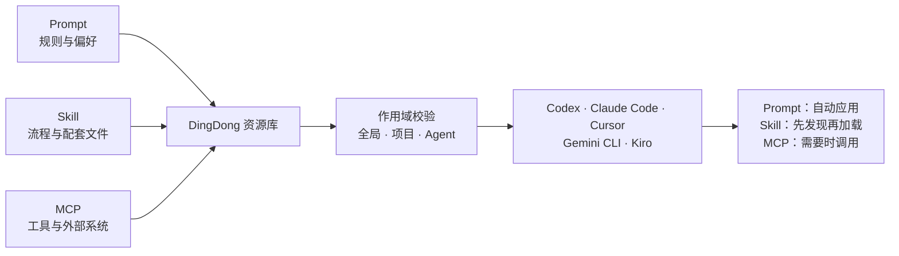

<p align="right">
  <a href="README.md">English</a> · <strong>简体中文</strong>
</p>

<p align="center">
  
</p>

<h1 align="center">DingDong</h1>

<p align="center">
  <strong>清晰管理剪贴板列表<br>统一管理提示词、Skill、MCP<br>Agent 执行结束，DingDong 提醒你</strong>
</p>

DingDong 1.0 是为内容工作和本地 Agent 设计的桌面伴侣：剪贴板记录清晰可查，
Prompt、Skill、MCP 只维护一份并接入常用客户端；Agent 做完、卡住或等你决定时，
DingDong 会用声音把你叫回来。

## DingDong 管理什么

| 模块 | 能力 |
| --- | --- |
| 剪贴板 | 搜索文本、链接、图片、文件、路径和命令；支持分组、匹配规则、预览、系统打开、复制、分享和二维码 |
| Prompt | 作用域匹配当前任务时，自动向 Agent 提供完整指令 |
| Skill | 管理包含 `SKILL.md`、脚本、参考资料和资源文件的完整 Package；先发现简介，再按需加载 |
| MCP | 只维护一份 Server 配置，同步到匹配的 Agent 客户端，并保留无关配置 |
| Agent 动态 | 在本机记录完成、阻塞和决策提醒，保留未读状态、重复次数和历史，并播放可配置提示声 |

剪贴板和资源数据默认只保存在这台电脑上。

## 统一管理 Prompt、Skill 和 MCP

每条资源只在 DingDong 中维护一次：启用、分组，并按需要设置工作区路径、仓库地址
或 Agent 来源范围。


```mermaid
flowchart LR
  P["Prompt<br/>规则与偏好"] --> D["DingDong 资源库"]
  S["Skill<br/>流程与配套文件"] --> D
  M["MCP<br/>工具与外部系统"] --> D
  D --> B["作用域校验<br/>全局 · 项目 · Agent"]
  B --> A["Codex · Claude Code · Cursor<br/>Gemini CLI · Kiro"]
  A --> R["Prompt：自动应用<br/>Skill：先发现再加载<br/>MCP：需要时调用"]
```

### Prompt、Skill 和 MCP 的调用逻辑

| 类型 | DingDong 如何提供 | Agent 应如何使用 |
| --- | --- | --- |
| Prompt | 每个任务开始时，`dingdong_bridge` 返回所有已启用且作用域匹配的完整 Prompt | 把每次成功 Bridge 响应视为权威替换快照，自动应用其中全部 Prompt |
| Skill | Bridge 只返回完整匹配目录中的 ID、名称和简介 | 先匹配简介，再调用 `dingdong_load_skill`；只通过 `dingdong_read_skill_file` 读取 Skill 明确引用的配套文件 |
| MCP | 已启用 Server 会同步到原生客户端配置；Bridge 只返回摘要 | MCP 是可用工具，不是每轮都要执行的指令；任务真正需要时再调用 |

配置相应资源后，可以直接这样和 AI 对话：

- “按这个项目的 UI 规范检查页面，把发现的问题直接改好。”
- “按这个项目的发布流程跑完所有检查，准备发布 1.2.7。”
- “用我配置好的 GitHub 工具，查一下 main 最近一次工作流为什么失败。”

用户明确授权后，Agent 也可以使用 `dingdong_install_skill`、
`dingdong_upsert_trigger_group` 和 `dingdong_bind_resource_scope`
直接配置项目专用 Skill。

## 让 Agent 直接安装

在本机 Codex、Claude Code、Cursor、Gemini CLI 或 Kiro 会话中粘贴：

```text
请从 https://github.com/JevonsCode/DingDongBuddy 在这台电脑上安装 DingDong。先读取并执行 https://raw.githubusercontent.com/JevonsCode/DingDongBuddy/main/INSTALL_WITH_AGENT.md，完成应用安装、MCP 接入、完成 Hook 接入和两项连接测试；保留所有现有用户数据与无关的 Agent 配置，不要只复述说明。
```

不绑定具体版本的权威操作位于
[INSTALL_WITH_AGENT.md](INSTALL_WITH_AGENT.md)。它安装官方 Release，不会克隆
或编译仓库。

手动下载：

- [macOS · Apple 芯片](https://github.com/JevonsCode/DingDongBuddy/releases/latest)
- [macOS · Intel beta](https://github.com/JevonsCode/DingDongBuddy/releases/latest)
- [Windows x64 beta](https://github.com/JevonsCode/DingDongBuddy/releases/latest)

macOS 需要 13 或更高版本。快速粘贴需要辅助功能权限；普通剪贴板历史不需要
“完全磁盘访问”或“屏幕录制”权限。

## Agent 兼容性与实测状态

“已实现”表示仓库中有持续维护的适配器和配置路径；“已验证”表示真实安装的客户端
已经把 MCP、完成 Hook 和适用的资源同步链路完整跑通。

| Agent | MCP 配置 | 完成事件 | 托管引导 | 当前验证状态 |
| --- | --- | --- | --- | --- |
| Codex | `~/.codex/config.toml` | `Stop` | Prompt Bridge | **已在 macOS 端到端验证** |
| Claude Code | `~/.claude.json` | `Stop` | Prompt Bridge | **已在 macOS 端到端验证** |
| Cursor | `~/.cursor/mcp.json` | `afterAgentResponse` | 无 | 已实现；待真实客户端端到端验证 |
| Gemini CLI | `~/.gemini/settings.json` | `AfterAgent` | 无 | 已实现；待真实客户端端到端验证 |
| Kiro | `~/.kiro/settings/mcp.json` | CLI / IDE Agent Stop | 无 | 已实现；待真实客户端端到端验证 |

### 接入原理

DingDong 使用两条互相独立的原生链路：

1. MCP Bridge 提供 `dingdong_bridge`、资源工具、配置工具和
   `dingdong_notify`。
2. 客户端输出最终回复后，完成 Hook 执行
   `dingdong_mcp --notify-stop --source <agent>`；不会再调用第二次模型。

自动接入会保留原生文件里的无关内容，包括 `~/.codex/config.toml`、
`~/.claude/settings.json`、`~/.cursor/hooks.json` 和
`~/.gemini/settings.json`。可执行文件或 MCP 配置变化后，Codex 可能要求
点击“**信任并启用**”。完整配置和验证矩阵见
[Agent Adapter 配置](docs/product/agent-adapter-configuration.md)。

## 默认快捷键和设置

全局面板快捷键与三个工作区快捷键都可以在“**设置 → 键盘快捷键**”中修改。

| 操作 | macOS | Windows |
| --- | --- | --- |
| 打开或隐藏剪贴板 | `⌘⇧V`（可配置） | `Ctrl+Shift+V`（可配置） |
| 打开动态 / 资源库 / 剪贴板 | `⌃Q` / `⌃W` / `⌃E`（可分别配置） | `Alt+Q` / `Alt+W` / `Alt+E`（可分别配置） |
| 聚焦搜索 | `⌘F` | `Ctrl+F` |
| 展开、重置或收起筛选 | `⌘R` | `Ctrl+R` |
| 使用可见的第 1–9 条 | `⌘1`–`⌘9` | `Ctrl+1`–`Ctrl+9` |
| 以纯文本使用当前可见的第 1–9 条 | `⌥⌘1`–`⌥⌘9` | — |
| 选择当前可见的剪贴板分组 1–5 | `⌃1`–`⌃5` | `Alt+1`–`Alt+5` |
| 移动条目 / 分组选择 | `↑` / `↓` · `←` / `→` | `↑` / `↓` · `←` / `→` |
| 预览选中条目 | `Space` | `Space` |
| 使用选中条目 | `Return` | `Enter` |
| 先关闭预览，再隐藏面板 | `Esc` | `Esc` |

| 设置项 | 默认值 | 可选值或范围 |
| --- | --- | --- |
| 主题 | 浅色 | 跟随系统 / 浅色 / 深色 |
| 窗口透明度 | 90% | 82%–96% |
| 默认页面 | 动态 | 动态 / 资源库 / 剪贴板 |
| 剪贴板监听 | 关闭 | 开启 / 关闭 |
| 剪贴板保留 | 5000 条、120 天 | 20–5000 条；1–730 天 |
| 完成提示声 | 经典叮咚 | 内置、自定义、系统声音或静音 |
| 本地 Agent API 端口 | `2333` | `1024`–`65535`；修改后需要重启 |

## 隐私与本机数据

- 剪贴板、资源、设置和 Agent 动态默认都在本机。
- 回环 API 只监听 localhost。
- DingDong 不包含统计分析或遥测。
- Agent 读取剪贴板正文默认关闭；元数据仍可用。
- 同步时会保留客户端中与 DingDong 无关的配置。
- GitHub Issue 表单要求提交前确认已移除敏感信息。

## 开发

桌面应用使用 Flutter 3.44.6，需要 Dart 3.12 或更高版本。

```bash
flutter pub get
flutter analyze
flutter test
flutter test integration_test/desktop_agent_connection_smoke_test.dart -d macos
flutter build macos --release
```

主要目录：

- `lib/features/activity/` — Agent 动态与未读状态
- `lib/features/clipboard/` — 采集、分类、搜索、预览和分享
- `lib/features/library/` — Prompt、Skill、MCP、作用域、导入和原生同步
- `lib/features/agent_api/` — 回环 API、MCP Bridge 和完成 Hook
- `docs/` — 官网、更新元数据、版本说明和产品文档

更多内容见[架构说明](docs/architecture/ai-companion-architecture.md)。

## 发布

`pubspec.yaml` 是版本来源。`main` 上的发布提交必须同步应用版本、
构建号、MCP Server 信息、官网、`docs/dingdong-release.json`、版本说明、
回归清单和版本契约测试。最新 `main` 提交通过 Flutter desktop 工作流后，
自动化才会创建 `v<version>` 标签并发布签名的 macOS、Windows beta、MCP
与更新源文件。

参阅[版本说明](docs/release-notes.md)和
[手工回归清单](docs/product/manual-regression.md)。

## 许可证

[MIT](LICENSE)
