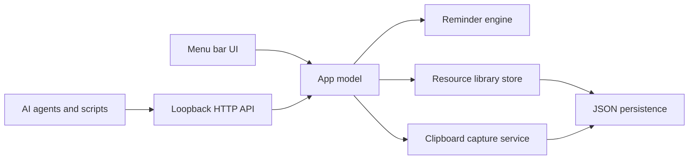

# DingDong AI Companion Architecture

## Product Direction

DingDong should become a lightweight macOS AI companion that lives in the menu bar and gives every local AI agent a shared set of desktop capabilities:

- Delightful completion reminders with a cheerful built-in sound.
- A shared resource library for prompts, skills repositories, MCP repositories, local knowledge sources, and clipboard records.
- A loopback-only API so Codex, Claude Code, Cursor agents, scripts, and local MCP tools can call the same desktop service.
- A compact, visually distinct control panel that feels like a companion utility instead of a generic settings app.

The app should remain fast: no always-on heavy indexing, no network dependency by default, no large resident database process, and no continuous clipboard polling at high frequency.

## UX Principles

- **Menu bar first:** The app should stay available without a Dock window. The menu bar item opens a compact companion panel.
- **Quiet until needed:** It should not interrupt except when an agent explicitly calls an API or the user opts into a watcher.
- **Resource-first UI:** The main panel should show recent agent calls, pinned prompts, clipboard snippets, and quick API examples.
- **Clear grouping:** Built-in groups should include `Prompts`, `Skills`, `MCP`, `Knowledge`, and `Clipboard`.
- **Fast capture:** Users and agents should be able to add a prompt, command, path, or clipboard record with a single API call.
- **Local trust boundary:** API listens on `127.0.0.1` only. Later remote access must require an explicit token and opt-in.

## Visual Direction

- Dark, compact panel with restrained blue and warm yellow brand accents.
- Use the provided blue/yellow bell-light logo as the app identity.
- Avoid large marketing-style hero sections; this is an operational desktop utility.
- Use dense but readable cards: recent alert, API status, pinned groups, quick actions.
- Future screens:
  - **Today:** active status, last alerts, pinned resources.
  - **Library:** searchable resource groups.
  - **Clipboard:** recent snippets, filters, pinning, source app metadata.
  - **Agent API:** examples, tokens, route health, recent calls.

## System Architecture



## Core Modules

- `NotificationServer`: Owns loopback HTTP listener.
- `NotificationRouter`: Routes API requests and returns JSON responses.
- `SoundPlayer`: Plays built-in cheerful sound, custom sound, system sound, or muted mode.
- `StatusController`: Owns menu bar item, panel state, flashing icon, and user actions.
- `ResourceLibrary`: In-memory model and persistence facade for agent resources.
- `ResourceStore`: JSON file persistence under Application Support.
- `ClipboardRecorder`: Low-overhead snapshot capture from `NSPasteboard`; no high-frequency polling by default.

## Resource Model

Resource types:

- `prompt`: Reusable prompts, system prompts, task templates.
- `skill`: Local or remote skill repository references.
- `mcp`: MCP server repository, command, or config reference.
- `knowledge`: Local files, folders, URLs, notes, and project references.
- `clipboard`: Captured clipboard snippets.

Resource fields:

- `id`: UUID string.
- `type`: one of the resource types.
- `group`: logical grouping, defaulting by type.
- `title`: display name.
- `content`: prompt text, snippet, URL, path, command, or note.
- `tags`: searchable tags.
- `source`: optional app name, path, URL, or agent name.
- `createdAt` and `updatedAt`: ISO 8601 strings.
- `pinned`: boolean.

## API Surface

Base URL: `http://127.0.0.1:2333`

Existing:

- `GET /health`
- `GET /ding`
- `POST /ding`

Planned and now partially implemented:

- `GET /library`
- `POST /library`
- `GET /library?type=prompt`
- `PATCH /library/{id}`
- `DELETE /library/{id}`
- `POST /clipboard/capture`
- `GET /knowledge/index?path=/local/docs&limit=20`
- `GET /knowledge/index?id=RESOURCE_ID`

Example:

```bash
curl --noproxy 127.0.0.1 -sS -X POST http://127.0.0.1:2333/library \
  -H 'Content-Type: application/json' \
  -d '{
    "type": "prompt",
    "group": "Prompts",
    "title": "Release note writer",
    "content": "Write concise release notes from this diff...",
    "tags": ["writing", "release"],
    "source": "Codex"
  }'
```

## Performance Strategy

- Store library data in a compact JSON file until the data shape proves SQLite is needed.
- Keep clipboard capture explicit or low-frequency opt-in. Do not watch every pasteboard change aggressively.
- Keep knowledge indexing on demand. Return bounded file metadata and short summaries first; defer full-text and vector indexing until there is a clear need.
- Keep resource payloads bounded. API should reject very large content bodies in a future hardening pass.
- Avoid embedding models or vector indexing in the menu bar process. If needed later, use a separate opt-in helper.

## Roadmap

1. **Foundation:** Resource model, JSON store, library API, happier sound.
2. **Clipboard:** Manual capture API and UI list; then optional low-frequency watcher.
3. **Library UI:** Groups, pinned prompts, tags, search, copy/insert actions.
4. **Agent API:** API docs panel, recent calls, optional token auth.
5. **Knowledge:** Local path registry, lightweight metadata, explicit re-scan command.
6. **Advanced AI companion:** Agent command palette, runbook templates, MCP config generator, prompt pack export/import.
