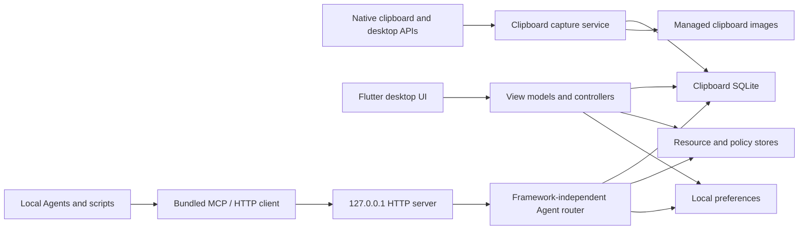

# DingDong Runtime Architecture

This document describes the current implementation. It replaces the original
macOS-only proposal and should not be read as a roadmap.

## Product and process boundary

DingDong is a Flutter desktop application with macOS and Windows platform
adapters. The main application process owns:

- the menu-bar/tray shell and desktop workspaces;
- clipboard monitoring, capture, history, and quick paste;
- the Prompt, Skill, MCP, and Knowledge resource library;
- recent Agent activity and completion notifications;
- a loopback HTTP server used by the bundled MCP executable and local clients.

The bundled MCP executable is a separate short-lived process. It discovers the
active HTTP port from the application-data `api-port` file and forwards
JSON-based tool calls to the running desktop application.

```mermaid
flowchart LR
    Native["Native clipboard and desktop APIs"] --> Capture["Clipboard capture service"]
    Capture --> ClipboardDb["Clipboard SQLite"]
    Capture --> ManagedImages["Managed clipboard images"]

    UI["Flutter desktop UI"] --> Models["View models and controllers"]
    Models --> ClipboardDb
    Models --> Library["Resource and policy stores"]
    Models --> Preferences["Local preferences"]

    Agents["Local Agents and scripts"] --> MCP["Bundled MCP / HTTP client"]
    MCP --> HTTP["127.0.0.1 HTTP server"]
    HTTP --> Router["Framework-independent Agent router"]
    Router --> ClipboardDb
    Router --> Library
    Router --> Preferences
```

## Durable data ownership

| Data | Store | Ownership and lifecycle |
| --- | --- | --- |
| Clipboard records | `clipboard-history.sqlite` | Bounded by item and age settings; pinned and archived records are exempt |
| Clipboard image data without a source file | `Clipboard Images/` | DingDong-owned and deleted with its ordinary record |
| Copied files, including image files | Original source path only | DingDong never duplicates or deletes the source |
| Prompts, Skills, MCPs, and Knowledge | `resource-library.json` plus managed Skill packages | User-managed; synchronized to supported Agent configurations |
| Trigger groups | `trigger-groups.json` | User-managed resource scope rules |
| Recent Agent details | `agent-activity.json` | Controlled by the recent-Agent retention settings |
| User settings | Platform preferences | Loaded by both the main and dedicated Settings windows |
| Active API port | `api-port` | Rewritten on each application start |

Application-data roots are:

- macOS: `~/Library/Application Support/DingDong`
- Windows: `%APPDATA%\DingDong`

Development builds use the corresponding `DingDong DEV` directory.

## Clipboard capture and retention

Clipboard payloads have three distinct storage paths:

1. Text and formatted text are stored in SQLite. HTML and RTF representations
   are retained when supplied by the platform.
2. A copied file selection stores newline-separated source paths. An image file
   is still a source-path record; deleting or moving the source makes it
   unavailable to preview or restore.
3. Image data without a file path, such as a screenshot or copied canvas
   pixels, is written to a DingDong-owned PNG file and the path is stored in
   SQLite.

Automatic retention applies the configured maximum ordinary-item count and
maximum age. Pinned and archived records do not count toward either limit.
When an ordinary managed-image record is trimmed or manually deleted, its owned
image file is deleted as well. Reconciliation also removes orphaned managed
files left by interrupted writes or older versions. Source files outside the
managed directory are never deleted.

**Clear history** is a separate explicit destructive action. It removes all
clipboard records, including protected records, and clears the managed image
directory.

## Loopback API trust boundary

The server binds only to `127.0.0.1`. It prefers the configured port, normally
`2333`, and falls back to another loopback port if needed.

Current transport protections are:

- `GET /` redirects to the configured DingDong website.
- `GET /health` remains a minimal public health response.
- Other requests carrying a browser `Origin` header or cross-site Fetch
  Metadata are rejected.
- State-changing routes use `POST`, `PATCH`, or `DELETE`; notification and UI
  actions are not available through `GET`.
- Every `POST` and `PATCH` request must use a JSON media type.
- Request bodies are limited to 8 MiB and the server uses a bounded idle
  timeout.

These controls prevent ordinary browser cross-origin reads, HTML form posts,
and common accidental calls. They do **not** authenticate another ordinary
local application running as the same operating-system user. DingDong currently
does not issue or require a Bearer Token. If the product later needs to defend
against other local applications or support remote access, that is a different
trust boundary and requires explicit authentication and migration design.

## Agent clipboard-content permission

`Allow Agents to read clipboard content` is a persisted DingDong setting and is
off by default.

While it is off:

- clipboard counts, groups, classifications, titles, timestamps, and other
  metadata remain available;
- requests with `includeContent=true` are rejected;
- API capture, collection, and promotion are rejected because each can expose
  clipboard content through its response or a newly created resource.

The router reads the persisted setting when a content-bearing request arrives,
so a change made in the dedicated Settings window takes effect without an
application restart.

When the setting is on, sensitive records remain protected by the existing
second gate: the caller must also explicitly set
`includeSensitiveClipboard=true`. Sensitivity classification is not treated as
a perfect secret detector; the user-controlled content switch is the primary
permission boundary.

## Main API groups

Representative routes are:

- Health and discovery: `GET /health`, `GET /agent/manifest`
- Completion notification: `POST /ding`
- Resource library: `GET|POST /library`, `PATCH|DELETE /library/{id}`
- Dynamic delivery: `POST /agent/bridge`, `GET /agent/skills/load`
- Clipboard metadata: `GET /clipboard/history`, `GET /clipboard/overview`
- Clipboard actions: `POST /clipboard/capture`,
  `POST /clipboard/restore/{id}`, `POST /clipboard/promote/{id}`
- Desktop control: `POST /ui/show`, `POST /clipboard/monitor`

Route behavior is tested independently through `AgentRouter`; socket-level
rules such as loopback binding, redirect, browser rejection, media type, and
body limits are tested through `AgentHttpServer`.

## Architectural constraints

- Remote measurement is enabled by default, can be disabled under **Settings →
  Version**, and is limited to two lifecycle events: a successful first launch
  and the first successful launch after a version change. There are no sessions,
  heartbeats, active-user signals, or behavior events. The Cloudflare Worker
  HMACs the random installation identifier before D1 storage and does not
  persist the source IP.
- Knowledge indexing is explicit and bounded; there is no resident vector
  database or embedded model.
- The resource library and clipboard history remain separate stores because
  they have different ownership and retention semantics.
- Platform code is kept behind gateways so contract and widget tests can run
  without real clipboard, notification, or window state.
- Future security work must state which attacker is in scope. Browser-request
  protection, local-application authentication, and remote access are separate
  decisions and should not be conflated.
